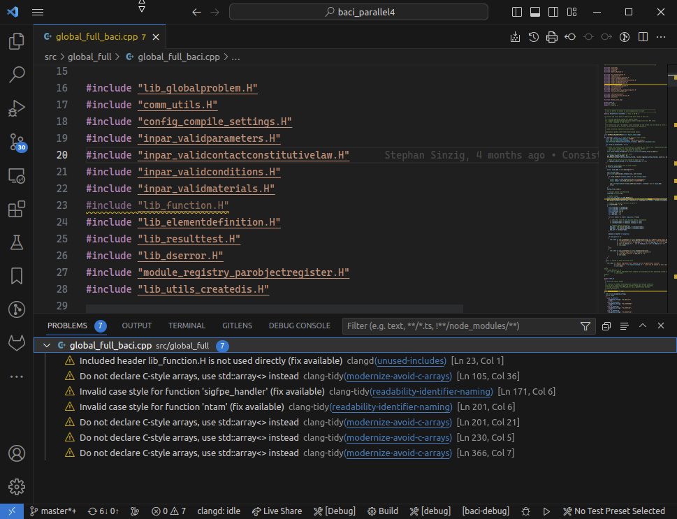

.. _SetupGuideto4C:

Setup Guide
=============

Here you'll find some useful notes on setting up and running |FOURC|,
the multi purpose multi physics multi-modelling code developed at

- Chair of Computational Mechanics,
- IMCS of the Hochschule der Bunderwehr München, and
- Institute of Material Systems Modelling of the Helmholtz Zentrum Hereon.

|FOURC| is developed and used on Linux. Other Unixes work as well.
Windows versions might be created using cygwin or mingw, but this will require some small modifications and is not covered here.
People around have already ported the code to Windows, but this needs quite a number of changes,
so it is not advised to try on your own, and the topic will not be covered here.
Additionally, |FOURC| can be compiled under Windows using the WSL (Windows Subsystem for Linux),
which provides a complete Linux Environment within the Windows operating system.

You'll find more information about the |FOURC| installation in the
`README.md <https://gitlab.lrz.de/baci/baci/blob/master/README.md>`_ and the
`CONTRIBUTING.md <https://gitlab.lrz.de/baci/baci/blob/master/CONTRIBUTING.md>`_
files located in the |FOURC| root directory.

Besides the basic setup of the software, the following topics are of particular interest for **all** developers:

- Read the :ref:`development guidelines <coding-guidelines>`.
- Documentation using Doxygen is mandatory. See our :ref:`Doxygen guidelines <doxygen>`.
- Speed up recompilation of the code after switching branches using :ref:`ccache <ccache>`.
- :ref:`Testing <4Ctesting>`
- :ref:`Coverage report <coveragereport>`
- :ref:`Code Debugging and Profiling Tools <debugging_profiling>`

.. _external-dependencies:

External dependencies
---------------------

|FOURC| heavily relies on the numerical library Trilinos developed mainly at Sandia National Lab,
but it also relies on some other external libraries, also called third party libraries (TPLs).
So we have to install TPLs first. Here's an list of the |FOURC|-related tools and a few notes on how to install them:

General software development:

- Git. Please see :ref:`here <git>` for setting up your personalized version
- c++ compiler with c++17 compatibility (e.g. gcc 11)
- MPI installation
- CMake (mandatory version: >= 3.25.x)
- Ninja

External solver and linear algebra:

- :ref:`Trilinos <trilinos>` (recommended version: 15.0)
- :ref:`SuiteSparse <suitesparse>` including Umfpack (recommended version: 5.4)
- :ref:`SuperLUDist <superludist>` (recommended version: 7.2.0)
- BLAS
- LAPACK

Graph and domain partitioner:

- Metis (recommended version: 5.1.0, included in SuiteSparse)
- ParMETIS (recommended version: 4.0.3)

Miscellaneous:

- Qhull (recommended version: 2012.1, :download:`install script <qhull/install.sh>`
- CLN (recommened version: 1.3.4) , :download:`install script <cln/install.sh>`
- FFTW
- HDF5
- ArborX (optional)

Post processing:

- Paraview (recommended version: 5.5) - newer versions may fail some post processing tests.

Build information
~~~~~~~~~~~~~~~~~

For many third party libraries, you'll find an installation file for the recommended version in the ``<4C_source>/dependencies/current`` directory.

.. _git:

**GIT**

The distributed version control system `Git <https://git-scm.com/>`__ is usually preinstalled on linux machines.
However, before you can use it, first configure some important settings.

.. note::

   If Git is not preinstalled, you can easily install it via your machine's package manager
   or download it from the `official website <https://git-scm.com/downloads>`_.

*Your Identity*

The first thing you should do is to set your identity, i.e., your username and email address.
Your identity is important because every Git commit you create uses this information, and once a commit is finished this information is unchangeable.
Please set your username to your full name, i.e., first name followed by last name,
and your email address to your institute email address with the following commands:

.. code-block:: bash

    git config --global user.name "Max Mustermann"
    git config --global user.email mustermann@<your_institution.your_tld>

.. note::

   You may want to use a different name or email address for other projects your are working on.
   For that purpose, you can run the above commands without the `--global` option when you are in a project folder.

*Default Text Editor*

You can configure the default text editor that will be used whenever you need to write a message in Git.
The following command will set your default text editor to `kwrite`, a gui-based editor.

.. code-block:: bash

    git config --global core.editor kwrite

If you choose not to set an editor, Git will use your system’s default editor.

.. _suitesparse:

**SuiteSparse**

|FOURC| uses SuiteSparse indirectly via the Trilinos package Amesos/Amesos2 for directly solving linear systems of equations.
See the `SuiteSparse repository <https://github.com/DrTimothyAldenDavis/SuiteSparse>`_ for details and downloads.

After downloading the package, the configure file can be found in ``SuiteSparse-5.4.0/SuiteSparse_config/SuiteSparse_config.mk``.
As |FOURC| uses BLAS/LAPACK in forms of libblas and liblapack, the respective linker flags need to be changed!

Instead of downloading manually, the complete download and installation is provided by an :download:`installation script example <suitesparse/install.sh>`
(taken from ``<4C_sourcce>/dependencies/current/suitesparse``)

.. _superludist:

**SuperLUDist**

|FOURC| uses SuperLUDist indirectly via the Trilinos package Amesos/Amesos2 for directly solving linear systems of equations in distributed memory fashion.
See the `superLU repository <https://github.com/xiaoyeli/superlu_dist>`_ for details and downloads.

Instead of downloading manually, the complete download and installation is provided by an :download:`installation script example <superlu_dist/install.sh>`
(taken from ``<4C_sourcce>/dependencies/current/superlu_dist``)

**ArborX**

ArborX can be used as optional dependency inside |FOURC| for utilizing it's tree-based search algorithms.
See the `ArborX repository <https://github.com/arborx/ArborX>`_ for details and downloads.

.. _trilinos:

**Trilinos**

This essential TPL can be downloaded from the `trilinos Github repository <https://github.com/trilinos/Trilinos>`__.
The currently used (and tested) version is tagged with *trilinos-release-15-0-0*.
Additionally, |FOURC| is tested weekly against the Trilinos develop branch. Though, this may not always work.

Instead of downloading manually, the complete download and installation is provided by an :download:`installation script example <trilinos/install.sh>`
(taken from ``<4C_sourcce>/dependencies/current/trilinos``)

Set-up your Gitlab account
---------------------------

The tool `GitLab <https://gitlab.lrz.de/>`_ is a web-based service to manage Git repositories.
In addition to hosting the actual repositories, GitLab provides wikis, issue tracking,
and an easy and transparent way for code review via `merge requests <https://gitlab.lrz.de/baci/baci/blob/master/CONTRIBUTING.md#merging-changes-into-master>`_.
The GitLab instance we are using is hosted by the Leibniz-Rechenzentrum (`LRZ <https://www.lrz.de/>`_).
Before you start working in the |FOURC| GitLab repository, set up your account according to the instructions below.

User Profile
~~~~~~~~~~~~

Your `profile settings <https://gitlab.lrz.de/help/user/profile/index.md>`_
are available from the up-right corner menu bar (look for the user's avatar) --> 'Settings',
or under `your profile <https://gitlab.lrz.de/profile>`_.

#. Under 'Main Settings' please enter your full name, i.e., first name followed by last name, in the 'Name' field.
#. You may want to add a foto of you as a 'Public Avatar' so people can recognize you more easily.
#. Hit 'Update profile settings'.

Change Your Username
~~~~~~~~~~~~~~~~~~~~

Please set your ``username`` to something recognizable.
It is recommended to set it to: first letter of first name followed by last name, all lowercase,
e.g., Max Mustermann :math:`\rightarrow` ``mmustermann``.

.. note::

   Your ``username`` is a unique namespace related to your user ID.
   Changing it can have unintended side effects.
   If you have already been using LRZ GitLab,
   read `how redirects will behave <https://gitlab.lrz.de/help/user/project/index.md#redirects-when-changing-repository-paths>`_ before proceeding.

To change your ``username``:

#. Navigate to your profile's :menuselection`Settings --> Account`, or try this `Link <https://gitlab.lrz.de/profile/account>`_.
#. Enter a new username under :command:`Change username`.
#. Hit :command:`Update username`.

Notification Emails
~~~~~~~~~~~~~~~~~~~

To set your institute email address as your GitLab notification email:

#. Go to profile's :menuselection:`Settings --> Emails` or use `this Link <https://gitlab.lrz.de/profile/emails>`__ .
#. Enter your email address in the 'Email' field.
#. Hit 'Add email address'.
#. Go to profile's :menuselection:`Settings --> Notifications`, or use `this Link <https://gitlab.lrz.de/profile/notifications>`__ .
#. In the 'Notification email' dop down menu choose your preferred notification email address.

To change your notification settings:

#. Go to profile's :menuselection:`Settings --> Notifications`, or use `this Link <https://gitlab.lrz.de/profile/notifications>`__ .
#. Adjust your 'Global notification level' according to your preferences.
   It is recommended to set your notification level at least to 'On mention'.
#. Alternatively, you may also adjust the notification level for each of your 'Groups' or 'Projects' individually.

SSH Keys
~~~~~~~~

`SSH keys <https://gitlab.lrz.de/help/ssh/README>`_ allow you to establish an easy and secure connection
between your computer and GitLab to push your local changes to the LRZ GitLab server.

To add a SSH key to your GitLab account please follow the instructions below
(or go to the `LRZ documentation <https://gitlab.lrz.de/help/ssh/README>`_):

#. Check for an existing SSH key pair

    Run the following command to check for an existing SSH key pair:

    .. code-block:: bash

        cat ~/.ssh/id_rsa.pub

    If you see a string starting with ``ssh-rsa`` you already have a SSH key pair.
    You should skip the next step and go directly to the copy to clipboard step.

#. Generate a new SSH key pair

    To generate a new SSH key pair, execute the following command:

    .. code-block:: bash

        ssh-keygen -t rsa -b 4096 -f ~/.ssh/id_rsa

    You will be prompted to input a password to secure your SSH key pair. You can skip creating a password by pressing enter.
    **Note:** It is best practice to use a password, but it is not required.

#. Copy your public SSH key to the clipboard

    Repeat step one.
    You should now see your public SSH key:
    a string starting with ``ssh-rsa``.
    Highlight the string and press |ctrl| + |shift| + C
    to copy it from the console to your clipboard.

#. Add Your Public SSH Key to GitLab

    Navigate to profile's 'Settings' > 'SSH Keys', or use `this Link <https://gitlab.lrz.de/profile/keys>`__.
    Paste your key in the 'Key' section by pressing |ctrl| + V.
    Give it a relevant 'Title' and hit 'Add key'.

#. Test your setup

    To test wether you have added your SSH key correctly, run the following command:

    .. code-block:: bash

        ssh -T git@gitlab.lrz.de

    You should see a `Welcome to GitLab` message.

Local adjustments
~~~~~~~~~~~~~~~~~~~~

Your Identity
"""""""""""""

The first thing you should do is to set your identity, i.e., your username and email address.
Your identity is important because every Git commit you create uses this information.
Please set your username to your full name, i.e., first name followed by last name,
and your email address to your institute email address with the following commands::

    git config --global user.name "Max Mustermann"
    git config --global user.email mustermann@lnm.mw.tum.de

.. Note::

    You may want to use a different name or email address for other projects your are working on.
    For that purpose, you can run the above commands without the ``--global`` option when you are in a project folder.

Set `git-hooks` directory
"""""""""""""""""""""""""

A common set of `git-hooks` to be used by all |FOURC| developers is checked in into the repository.

To set the path to our common set of `git-hooks`, run

::

    cd <4c-sourceDir>
    git config core.hooksPath ./utilities/code_checks/

.. Note::

    It is important to execute this command *inside* the |FOURC| source code folder,
    i.e. inside the |FOURC| Git repository. This command misses the `--global` option, so its scope is limited to the |FOURC| repository.

Check Settings
""""""""""""""""

To confirm the correct setup of Git, you may check your configuration settings with::

    git config --list

.. _4Cinstallation:

Download and install
--------------------

Here comes the main part.
After you have installed all the TPLs, you should download and install |FOURC| itself.

Clone the repository
~~~~~~~~~~~~~~~~~~~~~~~~~~~~~

::

    cd <someBaseDir>
    mkdir <sourceDir>
    git clone git@gitlab.lrz.de:baci/baci.git <sourceDir>
    cd <sourceDir>

where `<someBaseDir>` is some directory on your machine and `<sourceDir>` will contain the |FOURC| source code.
You can choose names and locations of these directories freely.

Your directory tree should look like the following::

    <someBaseDir>/
        <sourceDir>

Configure
~~~~~~~~~

First, you should create the python virtual environment for |FOURC| development.
You'll need that for testing and active development, you need to create a python virtual environment once.
In the source directory, execute::

    ./create-python-venv

.. note::

    You don't need to execute this command every time you generate a new |FOURC| executable.
    However, when changes in the virtual python environment have been made, you **must** generate a new environment locally as well.

|FOURC| enforces an out-of-source build, i.e. your build directory may not be located inside the source code directory.

|FOURC| uses ``cmake`` with appropriate presets (**this is why cmake version 3.25 is needed!**) for the build process.
The command to run is

::

    cmake --preset=<name-of-preset> <sourceDir> | tee config$(date +%y%m%d%H%M%N).log

Thus, a preset name needs to be passed to cmake via the command line argument ``--preset``.
Use

::

    cmake <4C_home> --list-presets

to get a list of all available presets.
In general, it is highly recommended to create your own preset, which is stored in ``<4C_home>/CMakeUserPresets.txt``.
In a preset within this file, you should define a few options that are important to your specific build:

- the build type. This is given by the variable ``CMAKE_BUILD_TYPE`` and can be ``DEBUG`` or ``RELEASE``.
- the build directory. It is good practice to indicate the value for ``CMAKE_BUILD_TYPE`` in the folder name, e.g. by
  ``"binaryDir": "<4C-basedir>/builds/release-build"`` (the folder name is completely up to you).

More information about the cmake presets can be found :ref:`here <cmakepresets>`.

.. note::

    When you see `command |& tee something$(date +%y%m%d%H%M%N).log`,
    that is just a means of running a command and sending the output both to the screen and to a timestamped log file.
    This is by no means necessary, but if you run into problems, having these timestamped log files can be quite useful in debugging what's gone wrong.

Build
~~~~~

Now you may run the compile command within the build folder.

::

    ninja -j <numProcs> full |& tee build$(date +%y%m%d%H%M%N).log

where `<numProcs>` is the number of processors you want to use.

.. note::

    After the first build, it is rarely necessary to reconfigure |FOURC| &mdash; only the build-command is required.
    `cmake` is invoked *automatically* during the build process if something changed within `CMakeLists.txt`.
    Make sure to have Ninja installed on your system.

To verify that the build was successful, it is highly recommended to run the test suite,
at least the small version of it.
You will find the information about it in the :ref:`testing <4Ctesting>` section below.

.. _set-up-your-ide:

Set-up your IDE
----------------

We recommend to use an Integrated Development Environment (IDE) for code development
because it eases various aspects of code development, e.g. indexing or code formatting.
Three of the most popular IDEs for larger software project are outlined in the following:

- :ref:`Eclipse <eclipse>`
- :ref:`CLion <clion>`
- :ref:`Visual Studio Code <visualstudiocode>`

.. _eclipse:

Eclipse
~~~~~~~~~

Eclipse is a GUI-based IDE that provides many convenient features like code indexing, Git integration, plugins for code formatting and many others.

**Setting up Eclipse**

.. note::

    These instructions might be outdated.

Let's assume that you already have cloned the repository and created a build directory as outlined above.
To include the |FOURC| source code into Eclipse and enable Eclipse to build |FOURC|, follow these steps:

- Open Eclipse Photon.
- :menuselection:`File --> New --> C/C++ Project`.
- Select "C++ Managed Build", then click "Next"
- Type a project name, uncheck "Use default location" and choose the source code folder with your local |FOURC| git repository instead.
- Select the 'Project type' as :menuselection:`Makefile project --> Empty Project`.
- Select the 'Toolchains' as 'Linux GCC'.
- Click Finish.
- Change to console and configure |FOURC| using ``cmake``.
- Now go back into Eclipse.
- Right-Click on the |FOURC| project in the :menuselection:`Project Explorer --> Choose Properties`.
- On "C/C++ General" in ”Paths and Symbols”, in the ”Includes” as well as in the ”Symbols” part click ”Add”, write some dummy name in the new window and click ”Add to all configurations” and ”Add to all languages”.
- On "C/C++ Build", select the tab "Builder Settings" and

   - de-select :command:`Use default build command`, then specify the build command as ``make -j`` with an appropriate number of processors
   - de-select ”Generate Makefiles automatically”.
   - select the build location/build directory as /build

- On :command:`C/C++ Build`, select the tab ”Behaviour” and remove ”all” from ”Build (Incremental build)” and press ”OK/Apply and Close”.
- Setup code style (see below) for correct behavior of tabs and white spaces.
- Close Eclipse.
- Change to console and reconfigure |FOURC| (the ”DEFINES” are now loaded into |FOURC|) be sure to use ``--ide=eclipse``.
- Build |FOURC| using ``make`` or ``make full`` for a complete build.
- Restart eclipse.

To enable the code indexer, right-click on the project and select :menuselection:`Index --> Rebuild`.

**Automation of code formatting**

*Source code*

|FOURC| uses a mandatory code style defined as a `.clang-format style file <https://gitlab.lrz.de/baci/baci/blob/master/.clang-format>`_.
Adherence to this code style will be checked on each commit as well as on each merge request.
To a priori conform to the codes style and avoid issues in your daily workflow,
you can configure Eclipse to apply the code style to your source code at every file save.
To do so, follow these steps:

#. Select "Eclipse Marketplace" from the "Help" menu and install the plugin CppStyle (Note that this requires Eclipse Photon or later)
#. Right-Click on the |FOURC| project in the :menuselection:`Project Explorer --> Choose Properties`.
#. On "CppStyle",

   - select "Enable project specific settings"
   - click on "Configure Workspace Settings" and set the "Clang-format path" to <4C-sourcedir>/utilities/python-venv/bin/clang-format.
   - select "Run clang-format on file save"

#. Click "Apply and Close"

Eclipse will now automatically format the code in accordance to the mandatory style every time you save a file.
This feature not only works for new code you are writing, but also you can select a block of code and have it reformatted with |ctrl| + |shift| + F.
Make sure that under :menuselection:`Window --> Preferences --> C/C++ --> Code Style --> Formatter` the settings for maximum characters per line are at least 110.
Otherwise some lines may be trimmed inadvertently.

*Other files*

All non-source-code files (like \*.dat, \*.md, ...) are still subject to formatting rules:

#. No tabs. Use 2 whitespaces instead.
#. No trailing whitespaces

Eclipse provides automated features to help you with these rules. To configure them, go to

#. :menuselection:`Preferences --> C/C++ --> Editor --> Save Actions` and

   - enable "Remove trailing whitespace"
   - select "In all lines".
   - click "Apply" and "Ok".

#. :menuselection:`Preferences --> C/C++ --> Code Style --> Formatter`

   - Click "Edit"
   - On "Indentation",

      - select the "Tab policy" to be "Spaces only".
      - Set the "Indentation size" to 2
      - Set the "Tab size" to 2

   - Click "Ok", then click "Apply" and "Ok".

*Automation and utilities for Doxygen documentation*

|FOURC| mandates documentation via Doxygen. Further information and an introduction is summarized in |FOURC|'s `Doxygen guidelines <https://gitlab.lrz.de/baci/baci/-/wikis/doxygen>`_.
Eclipse can assist in writing Doxygen documentation by auto-generating lists of input and return parameters when writing a function's documentation.

To enable this utility in Eclipse, perform these steps:

- :menuselection:`Project Properties --> C/C++ General`

   - Select "Enable project specific settings"
   - Select "Doxygen" in the drop down menu "Documentation tool"
   - Click "Apply and Close"

.. note::

    To configure Doxygen as default documentation tool for all your projects in Eclipse,
    go to :menuselection:`Preferences --> C/C++ --> Editor` and select "Doxygen" in the drop down menu "Workspace default".

*Include external resources into indexer*

Folders and files can be linked to locations in the file system outside of the project's location. These special folders and files are called linked resources.
This is particularly useful to include Trilinos packages into Eclipse's indexer.

To create a linked folder:

- Right-click the project or folder where you want to create the linked folder.
- Select "New --> Folder".
- Specify name of the folder as it will appear in the workbkbench. This name can be different from the name of the folder in the file system.
- Click "Advanced".
- Check "Link to alternate location (Linked Folder)".
- Enter a file system path, or click "Browse" to select a folder in the file system.
- Click "Finish".
- Right-click the project folder and select "Index --> Rebuild".

.. _clion:

CLion
~~~~~~

**Setting up CLion**

Let's assume that you already have cloned the repository and created a build directory as outlined above.
Now open CLion:

#. New project → choose the source code folder with your local |FOURC| git repository
#. Answer the prompt "Would you like to create a project from existing sources instead?" with "Yes".
#. :menuselection:`File --> Settings --> Build, Execution, Deployment`

   - Toolchains: Enter your desired cmake path
   - CMake: CLion will recognize the cmake presets automatically (the general as well as the user presets).
     You may click on the presets you want to use, and select the check box ``Enable Profile``.
   - Press "Ok"

#. Navigate to build folder → Run the correct do-configure command again with the specification of the IDE as an argument.
   You should get some output like "++ Update of .idea/workspace.xml file done".
#. In the top right, select target from the dropdown and build the project.

**Automation of code formatting**

|FOURC| uses a mandatory code style defined as a .clang-format style file.
Adherence to this code style will be checked on each commit as well as on each merge request.
To a priori conform to the codes style and avoid issues in your daily workflow, you can configure CLion to apply the code style to your source code at every file save.
To do so, follow these steps:

- :menuselection:`File --> Settings --> Editor`: Code Style tick "Enable ClangFormat (only for C/C++/Objective-C)"
- :menuselection:`File --> Settings --> Tools --> Actions on Save`: tick "Reformat code"

CLion will now automatically format the code in accordance to the mandatory style every time you save a file.
This feature not only works for new code you are writing,
but also you can select a block of code and have it reformatted with |ctrl| + |shift| + F.

.. note::

    There are some rare cases when the automated formatting within CLion is not doing exactly the same as expected in our code checks.
    However, this is not a problem because you can easily set up a so-called External Tool as described below:

- :menuselection:`File --> Settings --> Tools --> External Tools`: add an External Tool
- Give a Name and a Description as you wish
- In the Tool Settings:

   - Programs: here you need to enter the path to our |FOURC| custom clang-format i.e.
     ``<4C-sourcedir>/utilities/python-venv/bin/clang-format``
   - Arguments: here you enter this: ``-i --style=file $FileName$``
   - Working Directory: Enter the macro variable ``$FileDir$``

- Click on "OK" to confirm. Now you can run our custom clang-format on a specific file
  by opening this file in CLion and clicking on:
  :menuselection:`Tools --> External Tools --> <Name>` (the name you specified in step 2).

**Enable debugging with CLion**

The prerequisite is that you already have set up a debug configuration as explained above.
Make sure you have enabled a debug profile in your cmake settings.

- Select Edit Configurations... from the dropdown list right to the "green hammer".
- Click + to Add a new configuration and select CMAKE Application:

    - Enter a descriptive Name

        - serial debugging:

            - Select 4C from the dropdown menu for both Target and Executable

        - parallel debugging:

            - Select 4C from the dropdown menu for Target
            - Enter ``<PathToMpirun>/mpirun`` to Executable (find with ``which mpirun`` in console)
            - Add the arguments for mpirun:
              ``-np <NumberOfProcesses> <PathTo4C-debug>/4C <PathToTest/TestName.dat> <OutputPreFix>``

    - Add any other parameters you need for the program to run (for example, the input file name and the output basename) to the arguments.
    - Enter the path you want to run the program in (maybe the one where your input file is located) to Working directory
    - Remove everything in Before launch and click ok

- Select the created configuration from the dropdown list
- Click on the green beetle in the toolbar to start a debug run.

The program will run until it reaches the end, a breakpoint, or a segmentation fault.

.. _visualstudiocode:

Visual Studio Code
~~~~~~~~~~~~~~~~~~~

`Visual Studio Code <https://code.visualstudio.com/>`_ is a code editor optimized for building and debugging modern web and cloud applications.
It can also be used for developing |FOURC|.
Visual Studio Code can connect to a remote computer so you can work on your home computer via SSH, see `here <https://code.visualstudio.com/docs/remote/remote-overview>`_.

**Setting up VS Code**

Let's assume that you already have cloned the repository, created a build directory and created your own CMakeUserPreset.json as outlined above.
To include the |FOURC| source code into VS Code and enable VS Code to build |FOURC|, follow these steps:

#. Install C/C++ extension for VS Code
#. Install cmake extension for VS Code
#. Open folder with source code of |FOURC|
#. Select cmake preset of your choice

**Setting up VS Code for Remote Development**

Start from scratch without doing the instructions from above. Do not clone your repository on your local machine, all files remain on the remote machine)
Steps to do on your (remote) workstation:

#. Install VS Code

Steps to do on your local machine:

#. Install VS Code
#. Install Remote development pack plugin on your local machine: <https://marketplace.visualstudio.com/items?itemName=ms-vscode-remote.vscode-remote-extensionpack>
#. Add your remote workstation over the ssh connection via the Remote Explorer (one icon on the left side)
#. connect to your remote workstation
#. Install C/C++ extension via GUI (will install it on your local and remote computer)
#. Open |FOURC| source directory and start coding

**Clangd Language Server (Clang-tidy)**

To profit from clang-tidy (and many more features like cross-references, refactorings, code completion, navigation, find unused includes),
there is an vs code extension that enables clangd for VS Code.
For a full list of features see here: <https://clangd.llvm.org/features.html>

*Setup*

#. Install extension clangd from the marketspace: <https://marketplace.visualstudio.com/items?itemName=llvm-vs-code-extensions.vscode-clangd>
#. add a .clangd configuration file in your source directory. An example could look like this:

::

    CompileFlags:
        CompilationDatabase: /path/to/build_directory  # update this to your configuration
        Compiler: /usr/bin/mpic++
        Add: [-I/usr/lib/x86_64-linux-gnu/openmpi/include/openmpi, -I/usr/lib/x86_64-linux-gnu/openmpi/include, -pthread, -L/usr/lib/x86_64-linux-gnu/openmpi/lib, -lmpi_cxx, -lmpi] # take this from mpic++ --showme
    Index:
        Background: Build
    Diagnostics:
        UnusedIncludes: Strict

**Debugging with VS Code**

If you want to use VS Code for debugging, you need to add debugging configurations in .vscode/launch.jsonand a debug version of |FOURC|.
In the following, the following folder structure is assumed:

- `<4C-sourcedir>`: Path to the source files
- `<4C-debug-execdir>`: Path to the debug build version
- `<4C-problemdir>`: Path to the run directory

In the following, different configuration examples are given.
They have to be placed in .vscode/launch.json in the configurations-list.

*Debugging a serial run*

::

    {
        "name": "Debug input file",
        "type": "cppdbg",
        "request": "launch",
        "program": "<4C-debug-execdir>/4C",
        "args": ["/path/to/inputfile.dat", "<4C-problemdir>/xxx"],
        "cwd": "<4C-problemdir>",
        "setupCommands": [
            { "text": "handle SIGPIPE nostop noprint pass", "description": "ignore SIGPIPE", "ignoreFailures": true }
        ]
    }

*Debugging a serial restart*

::

    {
        "name": "Debug input file from restart",
        "type": "cppdbg",
        "request": "launch",
        "program": "<4C-debug-execdir>/build_debug/4C",
        "args": [
            "/path/to/inputfile.dat",
            "<4C-problemdir>/xxxx"
            "restart=1",
            "restartfrom=<4C-problemdir>/xxx"
        ],
        "cwd": "<4C-problemdir>",
        "setupCommands": [
            { "text": "handle SIGPIPE nostop noprint pass", "description": "ignore SIGPIPE", "ignoreFailures": true }
        ]
    }

*Debugging a unit test*

::

    {
        "name": "Unit test",
        "type": "cppdbg",
        "request": "launch",
        "program": "<4C-debug-execdir>/Unittests/unittests",
        "args": [
            "MAT::ELASTIC::CoupAnisoExpoAnisotropyExtension_TestSuite"
        ],
        "cwd": "<4C-problemdir>",
    }

*Debugging a MPI application*

All-Stop mode

This mode is the "normal" mode. On a breakpoint, all processes make a pause.

::

    {
        "name": "Debug MPI input file (all stop)",
        "type": "cppdbg",
        "request": "launch",
        "program": "/usr/lib64/openmpi/bin/mpirun",
        "args": [
            "-np",
            "3", // specify number of mpi ranks here
            "<4C-debug-execdir>/4C",
            "/path/to/inputfile.dat",
            "<4C-problemdir>/xxx",
        ],
        "cwd": "<4C-problemdir>",
        "setupCommands": [
            {
                "description": "On a fork, keep gdb attached to both processes.",
                "text": "-gdb-set detach-on-fork off",
                "ignoreFailures": false
            },
            {
                "text": "-gdb-set schedule-multiple on",
                "ignoreFailures": false
            }
        ]
    }

Tracking down race conditions

With this method, you have control to each processor during the execution.
However, you have to attach each processor manually.
Start |FOURC| with the following command in an extra terminal:

::

    ~/build_debug$ mpirun -np 2 ./4C input.dat out --interactive
    Global rank 0 with PID 17235 on helmholtz.lnm.mw.tum.de is ready for attach
    Global rank 1 with PID 17236 on helmholtz.lnm.mw.tum.de is ready for attach

    ** Enter a character to continue >

In the output, you see for each mpi rank the respective process id.
Now you can attach gdb to each process with the following configuration:

::

    {
        "name": "Attach gdb",
        "type": "cppdbg",
        "request": "attach",
        "program": "<4C-debug-execdir>/4C",
        "processId": "${command:pickProcess}",
        "MIMode": "gdb"
    }

Start it two times and choose in the prompt the respective process id.
Wait until both instances are connected and then start the computation by pressing any key in the 4C terminal.

.. _build4Cwithcustomtargets:

Build |FOURC| with custom targets
-----------------------------------

Above it was shown how to build all executables that come with |FOURC|.
However, one can also build just a subset or even specific libraries.
The command to build |FOURC| these specific targets is:

::

    ninja -j <numProcs> <customTarget>

where ``<numProcs>`` denotes the number of processors and ``<customTarget>`` the target you want to build (see below).

Custom target specifiers
~~~~~~~~~~~~~~~~~~~~~~~~

|FOURC| offers a variety of additional target specifiers <customTarget> (defined in ``CMakeLists.txt``) that can be used within the build command.
Here's a list of all valid custom target specifiers with a brief explanation:

Executables:

- ``4C`` generate the main |FOURC| executable only
- ``post_processor`` build the post-filters only
- ``pre_exodus`` build the pre processor (exodus to 4C converter) only
- ``post_monitor`` build a nodal data extraction application
- ``rtd`` build the reference documentation generator ``create_rtd``
- ``full`` generate all executable targets of |FOURC|

Documentation:

- ``doxygen`` create the Doxygen documentation only
- ``readthedocs`` create the user documentation (readthedocs style) only

Refer to ``CMakeLists.txt`` for a definition of all other target specifiers.

.. note::

    When omitting the custom target specifier in the build command, the default specifier 4C is used.

