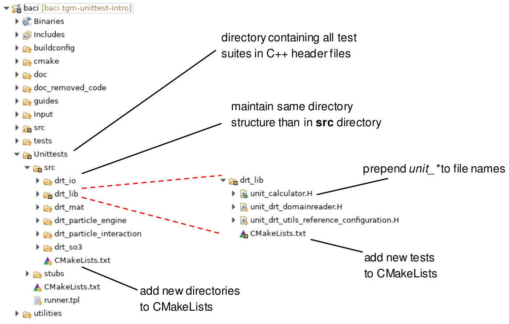
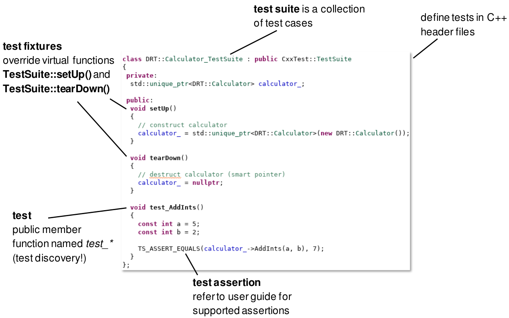

.. _4Ctesting:

Testing
=======

Clean code goes hand in hand with code testing, that is why in |FOURC| we set great value upon the latter.
This page is concerned with everything related to testing in |FOURC|.

.. _firstprinciples:

F.I.R.S.T. principles for writing clean tests
---------------------------------------------

The F.I.R.S.T. principles serve as a general guideline for writing framework tests or unit tests in |FOURC|.
Being an acronym F.I.R.S.T. stands for the following principles:

Fast
~~~~~

Unit testing benefits from extremely fast testing times.
Write meaningful framework tests while reducing the run time and number of processors of a single test
to keep overall testing time and resources in a reasonable scale.

- developers should run tests frequently
- slow tests also slow down code development

Independent/Isolated
~~~~~~~~~~~~~~~~~~~~~~

In |FOURC| there are some framework tests concerning mesh generation, pre-processing, or post-processing that may depend on a specific order of execution,
so whenever possible:

- tests should not depend on each other
- tests should pass independently of each other

Repeatable
~~~~~~~~~~~~

- tests produce the same result each time
- tests should be repeatable in any configuration/environment

|FOURC| is developed by contributors distributed among several institutes working on different configurations
(including cluster configurations)

Self-Validating
~~~~~~~~~~~~~~~~

Manually checking results is time consuming and prone to errors.
Anyway, it is inevitable to have an automated test result comparison within the pipeline.

- no manual interpretation of results
- a test fails or passes

Thorough
~~~~~~~~~~~~

- cover every use case scenario including corner/edge/boundary values
- test for illegal arguments or bad inputs, exceptions and errors

.. Note::

    following test driven developement (TDD) (refer to Robert C. Martin [Martin08]_ ) this can also be interpreted as:

    **Timely**

        - following TDD write tests just before writing code that makes them pass
        - helps designing code to be testable

    However, test driven development is discussed controversial in the community!

Overview on testing mechanisms
------------------------------

|FOURC| uses the ``ctest`` environment for testing (refer to `ctest <https://cmake.org/cmake/help/latest/manual/ctest.1.html>`_)
and relies on a variety of test mechanism to guarantee and maintain its intended behaviour.
Tests fall into these categories:

- Regression tests: test dat-file based simulations only (no pre-/post-processing)
- Unit tests: isolate and exercise specific units of source code independently from other parts
- Framework tests: tests the complete |FOURC| workflow (mesh generation, pre-processing, simulation, post-processing)

|FOURC| tests can be triggered through various mechanisms:

- On Gitlab, we use GitLab's CI pipelines. We run those pipelines every night, on every merge request, and on every change in main. In addition, they can be triggered manually.
- Locally, one can trigger ctest to run all or some tests.

    - filter tests by adding ``-R <regex>``. Only tests including ``<regex>`` in their names are performed
    - exclude tests by adding ``-E <regex>``. Tests with ``<regex>`` in their names are not performed
    - filter tests by adding ``-L <regex>``. Only tests with label ``<regex>`` in their names are performed
    - skip the clean up test by adding ``-FC test_cleanup``

- Particularly, if you want to run ctest on a single input file, simply run ``ctest -R <input_file>``,
  where ``<input_file>`` is the input filename without the ``.dat`` suffix. A ctest with that name should exist.

GitLab CI testing
-----------------

Pipelines
~~~~~~~~~

Details on the pipeline configuration can be found in our
`README on test configurations <https://gitlab.lrz.de/baci/baci/blob/main/tests/testconfig/README.md>`_.
In GitLab CI Pipeline Settings you find information on how to start tailored pipelines.

Guidelines for |FOURC| input files
~~~~~~~~~~~~~~~~~~~~~~~~~~~~~~~~~~~~~~

The ``*.dat``-file of a CI test (residing in ``<4C_sourcedir>/tests/input_files``) should include:

- A short but informative summary of what is tested, maybe also which results are compared,
  in the header
- No unused sections
- No unused parameters (as far as possible)
- No alternative input parameters/values as comment
- No empty lines

In general a "clean" format of the file is demanded (alignment of parameters/values).

Accompanying ``*.xml``-files will be formatted by ``pre-commit``. Check ``.pre-commit-config.yaml`` for details.

How to deal with failing tests
~~~~~~~~~~~~~~~~~~~~~~~~~~~~~~~~

- Merge request testing:
  If pipelines fail during merge request testing, just address the error.
  Note that you can only merge to the main branch if the pipeline succeeds.
- Nightly tests:
  If nightly tests on the main branch fail, open a `new issue <https://gitlab.lrz.de/baci/baci/issues/new>`_
  based on the issue template ``TEST_FAILING.md`` to report the failing pipeline
  and test and to provide a forum to discuss possible fixed and track progress.
- Minimal tests after merge into the main branch:
  Follow the same strategy as for a failing nightly test pipelines.

.. _unittesting:

Unit testing: good practice in software development
---------------------------------------------------

Unit tests isolate and exercise specific units of source code, e.g., functions or class methods, independently from other parts.

There are several advantages of unit tests, as for example:

- find problems early in development cycle
- reduce uncertainty in code testing (bottom-up testing approach)
- easy refactoring of code
- integration/framework testing becomes easier
- extremely fast testing times

However note that:

- framework, performance or system errors are not caught (unit testing always in addition to other testing mechanisms)
- problems arise when testing methods interact with external classes/applications

Good practice of writing unit tests
~~~~~~~~~~~~~~~~~~~~~~~~~~~~~~~~~~~~~~

What to test

- functions/methods
- every public member of a class
- that the class can be cast to any interface or base class it inherits from

Good practices

- unit tests should test one method only
- unit tests are not coupled together
- unit tests should use realistic but simple data
- name test suites after the class it is testing
- choose descriptive test names inside test suite
- do not use static members in a test class

.. note::

    concerning static members/singeltons refer to `Issue #186 (closed) <https://gitlab.lrz.de/baci/baci/-/issues/186>`_

Also refer to the :ref:`F.I.R.S.T. principles for writing clean tests <firstprinciples>`.

Executing |FOURC| unit tests
~~~~~~~~~~~~~~~~~~~~~~~~~~~~

Configure and build |FOURC| as described in `README <https://gitlab.lrz.de/baci/baci/blob/main/README.md>`_.
In the |FOURC| build directory ``<builddir>`` a subfolder ``unittests`` with executable unittests inside is generated.

    Note: in order to execute the following commands, change to build directory <builddir>

The |FOURC| unit tests are included in ctest as part of the minimal tests and also in the full test suite:

::

    ctest -L minimal
    ctest -R unittests

How to add unit tests to |FOURC|
~~~~~~~~~~~~~~~~~~~~~~~~~~~~~~~~

The framework ``CxxTest`` includes a test discovery mechanism (refer to `user guide <https://cxxtest.com/guide.pdf>`_)
that makes it very easy to add unit tests.

.. note::

    problems can arise with the test discovery of CxxTest and code formating of `clang-format` that can be avoided with a simple workaround as described here `Issue 187 <https://gitlab.lrz.de/baci/baci/issues/187#note_321659>`_

**File structure**

In |FOURC| the directory ``<Unittests>`` contains all files related to unit testing.

.. note::

    In general this are header files containing the unit test suite definition with corresponding unit tests.
    However, in some cases it is necessary to add scripts of tools to generate results (refer to `Issue #204 <https://gitlab.lrz.de/baci/baci/-/issues/204>`_)
    or files containing results to the directoy.

The file structure in this directory is similar to the file structure of the classes and methods to be tested in src directory. Refer to the figure below for an illustration.

**Unit test header files**

The unit test suite itself is then defined in header files with the name convention to prepend ``unit_*`` to the file names
(compared to the file containing the class to be tested in directory src).
Add the new unit test to the file ``CMakeLists.txt`` in the corresponding directory.
Keep all entries in aforementioned files in an alphabetical order.

The line in the header file defining the test suite class is very crucial for test discovery of ``CxxTest`` as it must be stated in one line without line break
(line breaks are possibly enforced by clang-format,
refer to `Issue #187 <https://gitlab.lrz.de/baci/baci/-/issues/187>`_ of how to circumvent this issue) and contain all namespaces of the class in this line!

Each test suite overrides the virtual functions ``TestSuite::setUp()`` and ``TestSuite::tearDown()`` to construct and destroy all objects needed for testing.
Those two functions are always executed before and after each call of a test function,
thereby fulfilling the requirement of independent/isolated testing of the :ref:`F.I.R.S.T. principle <firstprinciples>`.

Each unit test is then defined in a public function inside that header file being named with prefix ``test_*`` to be detected by test discovery.
This test function contains all necessary operations to perform the unit test including a test assertion,
e.g., ``TS_ASSERT_EQUALS(...)``, to check the results/states/... (refer to user guide of CxxTest for examples).

