.. _conventions:

Conventions
------------

1d Element
~~~~~~~~~~~~

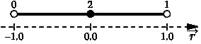

   Node numbering scheme and local coordinates for the line element

2d Elements
~~~~~~~~~~~~

Standard Quadratic Elements
^^^^^^^^^^^^^^^^^^^^^^^^^^^^^

.. figure:: figures/quad.jpg
   :alt: Node numbering scheme and local coordinates for the quad element
   :name: fig:conventions:2d
   :width: 400px
   :align: center

Line pattern:

::

   L0 :  0,  1,  4
   L1 :  1,  2,  5
   L2 :  2,  3,  6
   L3 :  3,  0,  7

Quad6 Elements
^^^^^^^^^^^^^^

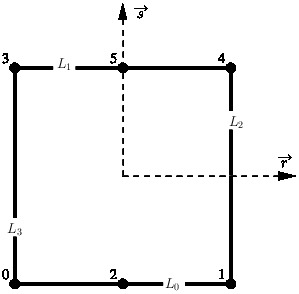

Line pattern for ``quad6``:

::

   L0 :  0,  2,  1
   L1 :  3,  5,  4
   L2 :  1,  4
   L3 :  0,  3

Triangular Elements
^^^^^^^^^^^^^^^^^^^

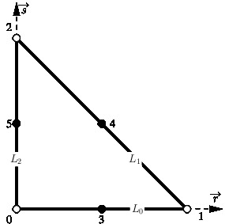

Line pattern:

::

   L0 :  0,  1,  3
   L1 :  1,  2,  4
   L2 :  2,  0,  5

Quadratic NURBS 9 Element
^^^^^^^^^^^^^^^^^^^^^^^^^

Line pattern:

::

   L0 :  0,  1,  2
   L1 :  2,  5,  8
   L2 :  6,  7,  8
   L3 :  0,  3,  6

3D Elements
~~~~~~~~~~~~

Standard Hexahedral Elements
^^^^^^^^^^^^^^^^^^^^^^^^^^^^^^

.. figure:: figures/hex_nodes.jpg
   :alt: Node numbering scheme and local coordinates for the linear hex element
   :name: fig:conventions:3d
   :width: 400px
   :align: center

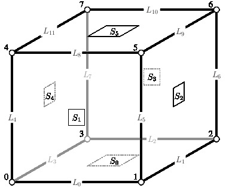

Surface pattern:

::

   S0 :  0,  3,  2,  1, 11, 10,  9,  8, 20
   S1 :  0,  1,  5,  4,  8, 13, 16, 12, 21
   S2 :  1,  2,  6,  5,  9, 14, 17, 13, 22
   S3 :  2,  3,  7,  6, 10, 15, 18, 14, 23
   S4 :  0,  4,  7,  3, 12, 19, 15, 11, 24
   S5 :  4,  5,  6,  7, 16, 17, 18, 19, 25

Line pattern:

::

   L0 :  0,  1,  8
   L1 :  1,  2,  9
   L2 :  2,  3, 10
   L3 :  0,  3, 11
   L4 :  0,  4, 12
   L5 :  1,  5, 13
   L6 :  2,  6, 14
   L7 :  3,  7, 15
   L8 :  4,  5, 16
   L9 :  5,  6, 17
   L10:  6,  7, 18
   L11:  4,  7, 19

Hex18 Element
^^^^^^^^^^^^^

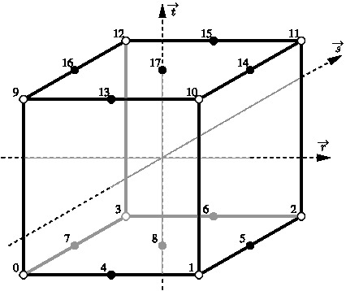

Surface pattern for ``hex18``:

::

   S0 : 0,  3,  2,  1,  7,  6,  5,  4,  8 
   S1 : 9, 10, 11, 12, 13, 14, 15, 16, 17 
   S2 : 0,  1,  4,  9, 10, 13
   S3 : 1,  2,  5, 10, 11, 14
   S4 : 2,  3,  6, 11, 12, 15 
   S5 : 3,  0,  7, 12,  9, 16 

Line pattern for ``hex18``:

::

   L0 : 0,  9
   L1 : 1, 10
   L2 : 2, 11 
   L3 : 3, 12
   L4 : 0,  1,  4
   L5 : 1,  2,  5 
   L6 : 2,  3,  6
   L7 : 0,  3,  7
   L8 : 9, 10, 13
   L9 : 10,11, 14 
   L10: 11,12, 15
   L11: 9, 12, 16 

Hex27 NURBS Element
^^^^^^^^^^^^^^^^^^^

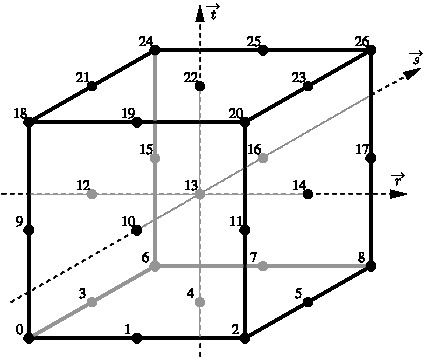

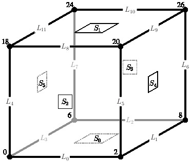

Surface pattern:

::

   S0 :   0,  1,  2,  3,  4,  5,  6,  7, 8
   S1 :  18, 19, 20, 21, 22, 23, 24, 25, 26
   S2 :   0,  1,  2,  9, 10, 11, 18, 19, 20
   S3 :   6,  7,  8, 15, 16, 17, 24, 25, 26
   S4 :   2,  5,  8, 11, 14, 17, 20, 23, 26
   S5 :   0,  3,  6,  9, 12, 15, 18, 21, 24

Line pattern:

::

   L0 :   0,  1,  2
   L1 :   2,  5,  8
   L2 :   6,  7,  8
   L3 :   0,  3,  6
   L4 :   0,  9, 18
   L5 :   2, 11, 20
   L6 :   8, 17, 26
   L7 :   6, 15, 24
   L8 :  18, 19, 20
   L9 :  20, 23, 26
   L10:  24, 25, 26
   L11:  18, 21, 24

Tetrahedral Elements
^^^^^^^^^^^^^^^^^^^^

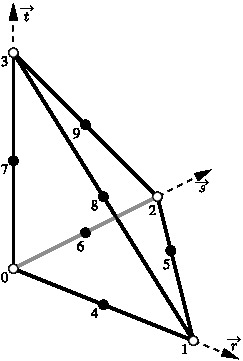

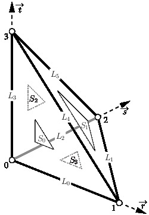

Surface pattern:

::

   S0 :  0,  1,  3,  4,  8,  7
   S1 :  1,  2,  3,  5,  9,  8
   S2 :  0,  3,  2,  7,  9,  6
   S3 :  0,  2,  1,  6,  5,  4

Line pattern:

::

   L0 :  0,  1,  4
   L1 :  1,  2,  5
   L2 :  0,  2,  6
   L3 :  0,  3,  7
   L4 :  1,  3,  8
   L5 :  2,  3,  9

Wedge Elements
^^^^^^^^^^^^^^

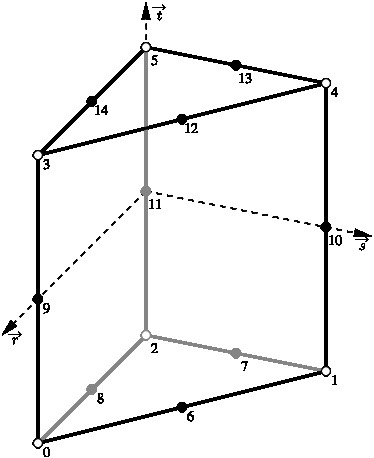

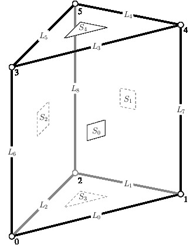

Pyramidal Elements
^^^^^^^^^^^^^^^^^^

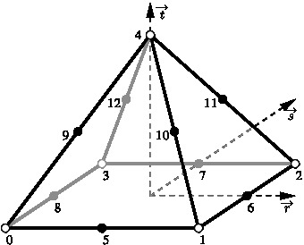

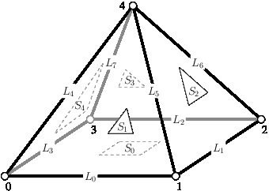

