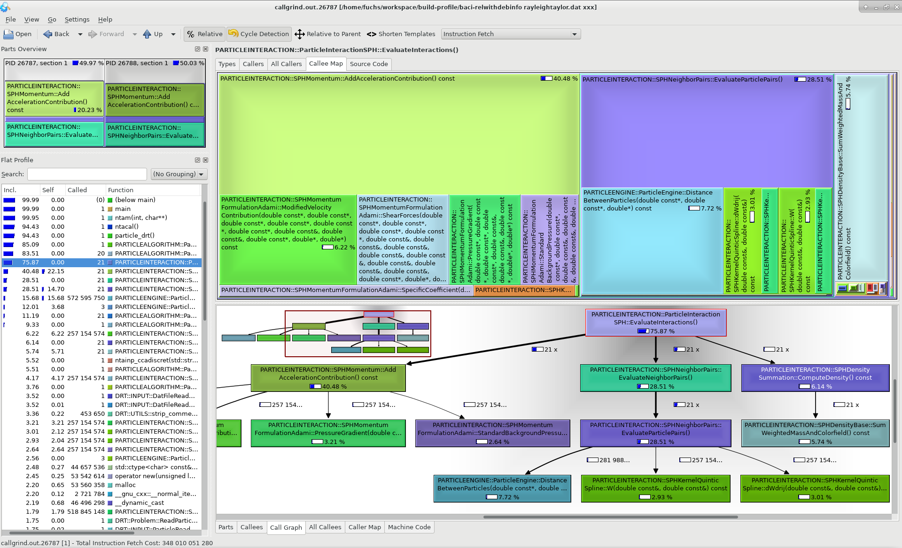

.. _debugging_profiling:

Debugging and Profiling Tools
------------------------------

In software development sooner or later one experiences that written software does not always behave as intended, or with the performance as expected.
This is were debugging and profiling tools come to hand that help understand what software is actually doing, or identify bottlenecks in the program execution.
However, not only software developers, also users of software written by others may benefit from debugging and profiling tools.

Overview of debugging and profiling tools
~~~~~~~~~~~~~~~~~~~~~~~~~~~~~~~~~~~~~~~~~~~~~~~

In the following various debugging and profiling tools are desribed that may be of help when developing or working with |FOURC|.

- Get MPI collective timer statistics with a :ref:`time monitor <Teuchos-Time-Monitor>` from ``Trilinos`` package ``Teuchos``
- Code profiling of |FOURC| with :ref:`callgrind <profiling_callgrind>`
- Debugging/MPI debugging with :ref:`VS Code <visualstudiocode>`

Useful options for Debugging with gdb (or your ide)
~~~~~~~~~~~~~~~~~~~~~~~~~~~~~~~~~~~~~~~~~~~~~~~~~~~~~

Build debug version of |FOURC|
""""""""""""""""""""""""""""""

Create a directory, where you want to build your debug version and build a |FOURC| with debug flag using the correct preset.
This should contain::

    {
      "name": "debug",
      "displayName": "Debug build for a general workstation",
      "binaryDir": "<4C-debug-execdir>",
      "generator": "Ninja",
      "inherits": [
        "lnm_workstation"
      ],
      "cacheVariables": {
        "CMAKE_BUILD_TYPE": "DEBUG"
      }
    }

Pretty printing of the Standard Library
""""""""""""""""""""""""""""""""""""""""""

Add the following to your `~/.gdbinit`

::

    python
    import sys
    sys.path.insert(0, '/usr/share/gcc/python')
    from libstdcxx.v6.printers import register_libstdcxx_printers
    register_libstdcxx_printers (None)
    end

    enable pretty-printer

Useful settings for MPI Debugging
""""""""""""""""""""""""""""""""""""""""""

**"Standard" parallel errors**

In this mode, all processes are paused once one process hits a debug event::

    set detach-on-fork off
    set schedule-multiple on

**Tracking down race conditions**

If you have to track down race conditions, you need manual control over each process.
You can start attach gdb to each process after it has already started. Start |FOURC| via

::

    mpirun -np 2 ./baci-debug ../path/to/input.dat ../path/to/output --interactive

The process id of each mpi process is being displayed.
Once all gdb instances are connected, you can press any key to start the execution.

**gdb + valgrind to track down memory leaks / invalid reads/writes**

::

    valgrind --tool=memcheck -q --vgdb-error=0 ./baci-debug path/to/input.dat path/to/output

Then, you can connect with a gdb debugger:

::

    gdb ./baci_debug
    (gdb) target remote | bgdb --pid=<insert pid here>

Or visually using VS Code:

Add a configuration in `launch.json`::

    {
      "name": "(gdb) Attach to valgrind",
      "type": "cppdbg",
      "request": "launch",
      "program": "<4C-debug-execdir>",
      "targetArchitecture": "x64",
      "customLaunchSetupCommands": [
        {
          "description": "Enable pretty-printing for gdb",
          "text": "-enable-pretty-printing",
          "ignoreFailures": true
        },
        {
          "description": "Attach to valgrind",
          "text": "target remote | vgdb --pid=<insert pid here>",
          "ignoreFailures": false
        }
      ],
      "stopAtEntry": false,
      "cwd": "/path/to/run/",
      "environment": [],
      "externalConsole": false,
      "MIMode": "gdb"
    }

If you need to run it in combination with mpirun, start it with

::

    mpirun -np 2 valgrind --tool=memcheck -q --vgdb-error=0 ./baci-debug path/to/input.dat path/to/output

and connect to each process individually.

.. _profiling_callgrind:

Code profiling with ``callgrind``
--------------------------------------

"Callgrind is a profiling tool that records the call history among functions in a program's run as a call-graph.
By default, the collected data consists of the number of instructions executed, their relationship to source lines,
the caller/callee relationship between functions, and the numbers of such calls."
(from `callgrind <http://valgrind.org/docs/manual/cl-manual.html>`_)

Configure and build |FOURC| with profiling flag
~~~~~~~~~~~~~~~~~~~~~~~~~~~~~~~~~~~~~~~~~~~~~~~~~~

**Note:** For general information about configuring and building of |FOURC| refer to :ref:`Configure and Build |FOURC| <4Cinstallation>` and the ``README.md``.

Configure |FOURC| with the optional profiling flag

::

    cd <someBaseDir>/<buildDir>
    <someBaseDir>/<sourceDir>/do-configure --config=<path/to/build-configuration-file.config> --profiling

and finally build |FOURC|

::

    ninja -j <numProcs> full

This results in a release version of the |FOURC| build with additional per-line annotations. That way, when examining the results one can see the exact lines of code where computation time is spent.

.. note::

    * Beware that code gets inlined with the profiling build of |FOURC| and hot spots might appear within the inlined section.
    * The debug version of |FOURC| also contains per-line annotations but without the effect of inlining and can thus also be used to profile |FOURC|.
      However, the debug version is compiled without compiler optimizations and thus does not give a representative view of hot spots.
    * For a quick profiling without per-line annotations also the release version can be used. This already gives a nice overview of computationally expensive methods.

Run simulation with `valgrind`
~~~~~~~~~~~~~~~~~~~~~~~~~~~~~~

Run a |FOURC| simulation with ``valgrind`` in parallel using the command::

    mpirun -np <numProcs> valgrind --tool=callgrind <someBaseDir>/<4C-execdir>/baci-relwithdebinfo <inputfile> <output>

In addition to the usual |FOURC| output, ``valgrind`` writes output for each mpi rank in the files ``callgrind.out.<processId>``.

.. note::

    - For profiling a simulation in serial execute::

        valgrind --tool=callgrind <someBaseDir>/<4C-execdir>/baci-relwithdebinfo <inputfile> <output>

    - It is also possible to examine the post processing of result files, simply wrap the corresponding command::

        mpirun -np <numProcs> valgrind --tool=callgrind <command>

    - Wrapping the |FOURC| simulation using ``valgrind`` increases the runtime by a factor of about 100.
      Therefore, to reduce the total wall time think about running only a few time steps of your |FOURC| simulation.
      Depending on the problem type it might be reasonable to do this after a restart in order to examine characteristic parts.
      Follow the steps as described below::

        mpirun -np <numProcs> <someBaseDir>/<4C-execdir>/baci-relwithdebinfo <inputfile> <output>
        mpirun -np <numProcs> valgrind --tool=callgrind <someBaseDir>/<4C-execdir>/baci-relwithdebinfo <inputfile> <output> restart=<restartStep>

Examine results with ``kcachegrind``
~~~~~~~~~~~~~~~~~~~~~~~~~~~~~~~~~~~~~

Using `kcachegrind` (refer to `kcachegrind <https://kcachegrind.github.io/html/Home.html>`_ for documentation and download)
the output can be visualized via::

    kcachegrind callgrind.out.*

It is also possible to only open the output of a specific mpi rank with processor id <processId> via::

    kcachegrind callgrind.out.<processId>

**Note:** Be sure to check out the |FOURC| version the code is compiled with in your local git repo to make use of the per-line annotations.

**Example:** In the figure below a screenshot of `kcachegrind` is given where the profiling output of a Smoothed Particle Hydrodynamics (SPH) simulation is visualized.

