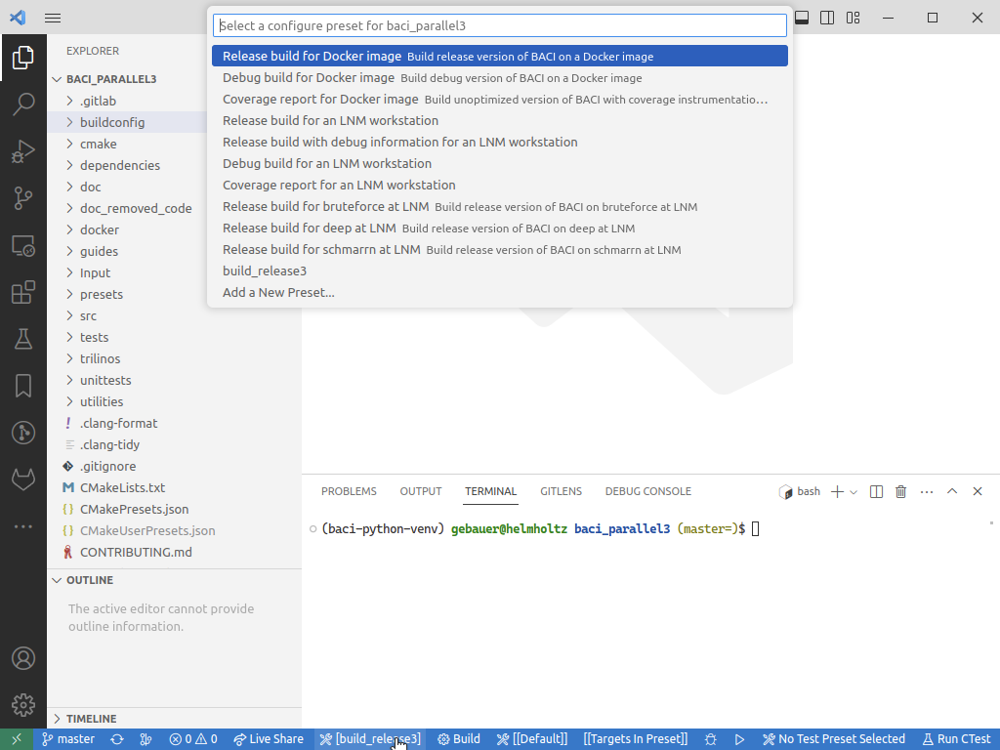

.. _cmakepresets:

cmake presets
--------------

CMake presets have been introduced with the Merge Request `!1392 <https://gitlab.lrz.de/baci/baci/-/merge_requests/1392>`_
and can be used to configure and manage different configurations of |FOURC| in a very convenient way.
This small article will go through a few of them. The experts should also read the
`official CMake presets documentation <https://cmake.org/cmake/help/latest/manual/cmake-presets.7.html>`_ to get all convenient tricks.
If you find a nice one, feel free to tell your colleagues (via issue, Slack or TGM).

CMake presets are available since cmake 3.19 and have been improved in the following versions.
We are currently using CMake preset version 5, which requires at least cmake 3.24.
Make sure to have a sufficient cmake-version in your path or use the provided onces on the institute's server.

Configuration from a terminal
~~~~~~~~~~~~~~~~~~~~~~~~~~~~~~

Suppose you are in the build directory where you want to build |FOURC|. You can configure a release build of |FOURC| with::

    cmake --preset=lnm_workstation ../path/to/source

**Hint:** The global configurations of cmake are stored in the ``CMakeCache.txt`` within the build folder
and it's sometimes helpful to remove it with ``rm CMakeCache.txt``, before configuring the project new.

There is a number of available preset files, which can be retrieved by ``cmake <4C_sourcedir> --list-presets``.
This is the current output of this command:

.. literalinclude:: 4C-cmake-presets.txt

In general, it is highly recommended to create your own preset, see bélow.

Defining your own CMake presets
~~~~~~~~~~~~~~~~~~~~~~~~~~~~~~~~

CMake presets allow you to also create your own configuration.
You need to put a ``CMakeUserPresets.json``-file (**important:** ``User``) in the source-directory of |FOURC|.
This file will not be part of the repository (it is listed in ``.gitignore``).
There you can define your own configurations.
Particularly, you may define the binary directory,
so you don't need to go to your binary directory in order to configure |FOURC|.
CMake presets integrate well with recent releases of IDEs.

You can define as many configurations as you need.
Note that you can inherit from other configurations by using the keyword ``inherits``.

Such a local preset could look like this::

    {
      "version": 5,
      "configurePresets": [
        {
          "name": "myworkstation",
          "displayName": "Release build for my workstation",
          "binaryDir": "<4C-execdir>/baci_release",
          "generator": "Ninja",
          "inherits": [
            "lnm_workstation"
          ],
          "cacheVariables": {
            "CMAKE_CXX_COMPILER": "/usr/bin/mpic++",
            "CMAKE_CXX_COMPILER_LAUNCHER": "ccache",
            "BACI_WITH_GOOGLETEST": "OFF",
            "BACI_BUILD_READTHEDOCS": "ON",
            "BACI_SPHINX_THEME": "sphinx_rtd_theme",
            "BACI_BUILD_DOXYGEN": "ON",
          }
        }
      ]
    }

Don't be overwhelmed by the options you could potentially set.
For a basic build of |FOURC|, you should start with `CMAKE_BUILD_TYPE` (either `RELEASE` or `DEBUG`) and maybe a compiler. We try to
detect reasonable defaults for you internally. Over time you might realize that you want to turn on
additional dependencies or features. To see which other options you can set, consult
the console output of CMake or run `ccmake .` in the build folder.

**Remark:** Variables either start with the prefix `BACI_` indicating that this variable only affects |FOURC| itself,
or they start with `CMAKE_` indicating that the variable (potentially) affects all dependent projects in a way
specified directly in the CMake documentation.

Configuration from the IDE
~~~~~~~~~~~~~~~~~~~~~~~~~~~~

Our recommended IDEs (VS Code and CLion) already support cmake presets natively.

Here is a screenshot taken from VS Code:

Hints for VS Code: You need to install the extensions "CMake Tools" from Microsoft.

For CMake maintainers
~~~~~~~~~~~~~~~~~~~~~

This section documents how we write the CMake code. For users and developers who do not
work on the build system, this section is not necessary.

Conventions
...........

- In general, do not modify `CMAKE_` variables inside CMake files!
  They affect downstream packages (e.g. from `fetch_content`) as well and we cannot easily know
  whether these packages can handle our settings.
- Prefer the modern CMake way and use targets over variables when handling requirements and dependencies.
- Every variable that is supposed to be set from outside has to start with `BACI_`.
  Variables that toggle a dependency are named `BACI_WITH_<PACKAGE>`. Further options for a package
  are specified by `BACI_<PACKAGE>_<OPTION>`.
- The top-most install directory of a dependency is supplied by the `BACI_<PACKAGE>_ROOT` variable.
  When possible we try to use CMake files exported by dependencies. For older
  libraries we write our own `Find<package>.cmake` modules.
- Every function that is supplied by this project starts with `baci_`.
- CMake files are automatically formatted according to the style defined in
  `./utilities/code_checks/.cmake-format.yaml`.

General
.......

Prefer to write small CMake helpers that do the necessary steps as automatically
as possible. CMake is a language that can be used in many ways. Not many
developers know CMake details, so we try to make their life easier by providing
a few simple functions that do what is necessary while hiding the details.

Configuring dependencies
........................

We use a two-step process to configure dependencies. The dependencies are listed in the
top-level CMakeLists.txt. A helper function takes care of basic checks that user input
for a dependency is sensible and then calls the respective configuration script. From this
script the package search is started via `find_package` which will either look for a
packaged config file or use our own finders defined in `cmake/modules`.

Internal dependency management
..............................

The code base is split into multiple modules, that consist of several files.
A module is built by compiling the source files (\*.cpp) into object files (\*.o).
For building, information from other modules may be necessary.
CMake calls this information "usage requirements" and it mainly consists of header files (\*.hpp) and define flags from other modules.
Notably, the compiled object files of a module are not needed to build another module. They only become necessary when an executable is built.
This leads us to the following strategy:

When defining a module `module_name`:

- Define a CMake `INTERFACE` target conventionally called `module_name_deps` which contains all the headers and usage requirements of
  the module.
- If another module `module_other` is required for building `module_name`, this module is added as
  `baci_add_dependency(module_name module_other)`. This step encodes internal dependencies.
- Define a CMake `OBJECT` target conventionally called `module_name_objs` which contains the source files. If a module is
  header-only, this target is not defined.
- Add the `OBJECT` target to a central library which contains all compiled sources.

Any executable links against the central library. Note that the central library may have a certain modules turned on or
off, once that module is refactored enough to separate it from the rest of the library.

This strategy comes with a number of useful properties:

- We can build the central library as a shared or a static library.
- All object targets can be built independently and simultaneously which offers a high degree of parallelism.
- It allows cyclic dependencies between modules. Although we work towards removing cyclic dependencies, the code is not
  there yet and we need to be able to build what we have.

