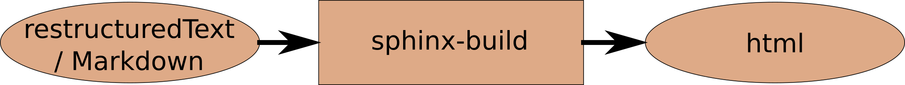

.. _writingdocumentation:

Writing documentation
=========================

Usage
-----

Previously the user documentation was written in LaTeX. 
Now we switched to a format that can be easily converted to html in order to include it in a readthedocs environment. 
An easy transformation is used by the following tool chain:



   From ascii files to websites

The ascii files are written in restructuredText or markdown. 
While restructuredText conversion is the native implementation of sphinx, markdown works well, too.
Both can be converted to an html document and provided to <https://www.readthedocs.org>.

Here, I'll give some hints, mainly for myself ;-)

- Headers are sorted automatically. Actually, it is not necessary to use specific header, 
  since Sphinx sorts the header by itself. However, it's good practice to use a specific format. 
  Mainly I use the following

  - Parts: ``#####`` with both overlines and underlines
  - Sections: ``=====`` 
  - Subsections: ``------``
  - Subsubsections: ``~~~~~~~~``

- In Markdown the headers are defined by the number of hashmarks in front of the Title.

  - Parts: ``# Part title``
  - Sections: ``## Section title`` 
  - Subsections: ``### Subsection title``
  - Subsubsections: ``#### Subsubsection title``

- While in restructuredText a paragraph has to be surrounded by a blank line, this is not the case for Markdown

- Links to other headers can easily be included in restructuredText by ``:ref:`Descriptive link name <sectionname>```, e.g., :ref:`The BACI Workflow <baciworkflow>`.
  The link target can be a section name, but also an explicit link target. 
  The latter is preferred, since there may be duplicate section names in the documentation. 
  A link target must be entered by ``.. _targetname:``
  From my small experience it seems that the link to a section name does not contain spaces, 
  even if the section title does contain them 
  (However, I saw spaces in other documentations many times). 
  As an example, you'll find a link to the top of this page :ref:`here <writingdocumentation>`. 
  Links also work between pages, of course.

- Links to other website are included  by, e.g., ``<http://www.readthedocs.org>`` (<http://www.readthedocs.org>), that is, no back quotes are needed if the website is printed directly.
  If the link should show a different text, use back quotes and an underscore at the end, like this: ```ReadTheDocs <http://www.readthedocs.org>`_`` , which then looks like `ReadTheDocs <http://www.readthedocs.org>`_.

- References are given in ``references.rst``. 
  You'll see how to prepare such a reference as soon as you open the file.
  The corresponding citation is created at any place by ``[referencename]_``, see, e.g., [Wall99]_.

- Tables are often entered in a rather strict format like this

  ::

     +----------+----------+
     + Header 1 | Header 2 |
     +==========+==========+
     | Left col | Right col|
     +----------+----------+

  However, this method is very time-consuming, and it may be difficult to add a new row or column, 
  since the vertical lines must be perfectly aligned. The recommended since easier and more versatile way 
  of adding a table is the following:

  ::

     .. list-table::
     header-rows: 1

     * - Header 1
       - Header 2
     * - Left col
       - Right col


- Images can be entered in the following way:

  ::

     .. figure:: path_to_figure/figure.jpg
        :alt: This is the alternative name, if the figure cannot be shown
        :width: with should be given in pixels (e.g., 400px), but can also be given in %.
        :align: "top", "middle", "bottom", "left", "center", or "right"

        After one empty line, a figure caption is given (like this one). 
        Beware that the indentation must not change!

  Note that figures cannot natively entered in markdown. However, there is a way to enter them anyway by declaring a restructuredText element within the markdown file:

  .. code-block:: markdown

     ```{eval-rst}
     .. figure:: path_to_figure/figure.jpg
        :alt: This is the alternative name, if the figure cannot be shown
        :width: with should be given in pixels (e.g., 400px), but can also be given in %.
        :align: "top", "middle", "bottom", "left", "center", or "right"

        After one empty line, a figure caption is given (like this one). 
        Beware that the indentation must not change!
     ```

  There may be other feature not included in markdown which can be entered in markdown by the exact same way.

- Math can be inserted either within the text or as separate equations.
  For inline math one may use the ``math`` rule like `` :math:`f(x) = x^2` ``. 
  Separate equations are writen as a directive ``.. math::``, for example:

  ::

     .. math::

        f(x) = \int_{\partial \Omega} \sigma_{ij}(\mathbf{x}) : \varepsilon_{ij}(\mathbf{x}) \mathrm{d} A

  which leads to

  .. math::

     f(x) = \int_{\partial \Omega} \sigma_{ij}(\mathbf{x}) : \varepsilon_{ij}(\mathbf{x}) \mathrm{d} A


- You can emphasize text both in markdown and restructuredText by making it **bold** (using double aserisks before and after: ``**bold**``, 
  or print it in *italic* (using single asterisk before and after: ``*italic*``).

