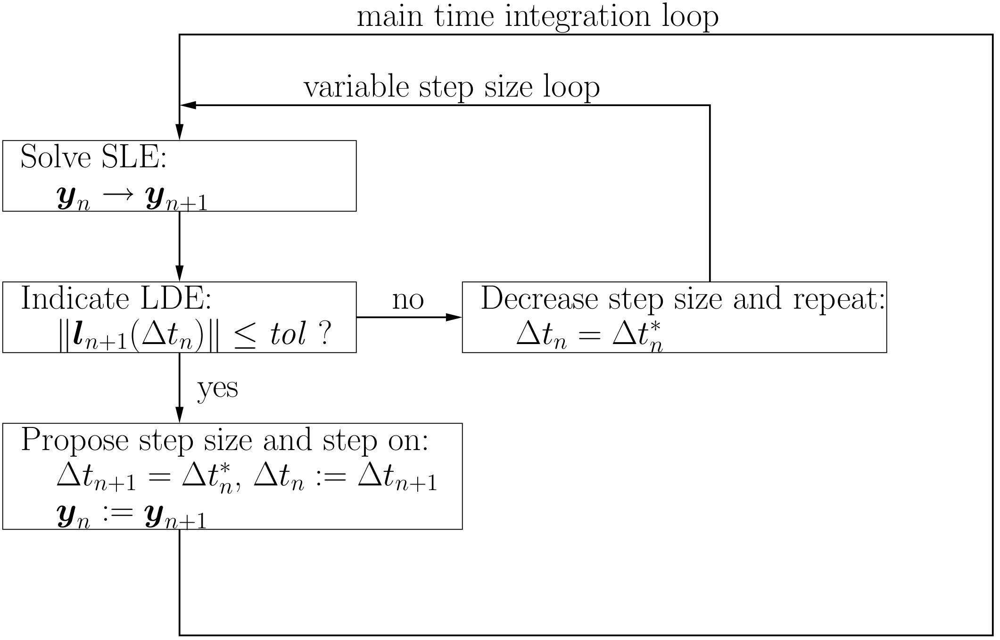

Solving nonlinear systems in structural simulations
===================================================

Life is nonlinear, and so are most of the simulations. Thus, the simulation software must be able to deal with nonlinear simulations, be the reason for the nonlinearity a large strain formulation, a nonlinear material model or nonlinear boundary/contact condition.

Since the theory of nonlinear finite element simulations is complex, we will only give an introduction of the necessary input parameters here.

The basic details of the nonlinear solver are given in the section

::

   ----------------------STRUCTURAL DYNAMICS

First of all: since in contrast to a linear simulation, 
where we may scale results (displacements, strains, stresses) with a factor, and also superpose load cases by simply adding results of each load case, 
the load history is crucial in nonlinear simulations, and we commonly divide the simulation in steps (other programs denote these as *increments*).

Users may give the time step size, the maximum time at the end of the simulation, and the maximum number of steps to be conducted by these parameters (the values behind the keywords show the default values):

::

   TIMESTEP  0.05
   MAXTIME   5
   NUMSTEP   200

Note that the simulation stops after NUMSTEP steps or at time=MAXTIME, whatever comes first.

The main decision in a simulation is whether to account for inertia and other time dependent effects, that is, conducting a dynamic simulation, or ignoring these effects and conducting a static simulation. Several options exist for dynamic simulations, while there is only a single option for statics. For the concrete input, see :ref:`DYNAMICTYP<structuraldynamic_dynamictyp>`.

Time stepping in dynamic simulations
------------------------------------

The time stepping in dynamic simulations may be implicit or explicit. While an implicit method involves an iterative procedure within each time step, the explicit solver is solely using the results of the previous time step to calculate the results of the current step. The time stepping procedure is given by the parameter 

Explicit time stepping procedure
~~~~~~~~~~~~~~~~~~~~~~~~~~~~~~~~

While it sounds much easier (and thus faster) to base the solution of the current time step on the previous step without iteration, the main drawback is that the time step must be in general much smaller than for an implicit solver.  In order to get a correct solution, the time step in an explicit procedure must be small enough that a stress wave cannot travel farther than the smallest element characteristic length in a single time-step. This is called the Courant-Friedrichs-Lewy (CFL) condition. One may calculate this maximum time step size by 

.. math::

   \Delta t \le f \left[ \frac{h}{c} \right]_{\min} \quad \text{with} \quad c=\sqrt{\frac{E}{\rho}}

Here, :math:`h` is the characteristic length of a finite element, :math:`E, c, \rho` are the Young's modulus, the speed of sound and the density of the material, and :math:`f` is a safety factor, usually equal to or smaller than 1.

.. note::

   It is the responsibility of the user to choose the time step small enough 
   to get a realistic result in an explicit analysis.

Implicit time stepping procedure
~~~~~~~~~~~~~~~~~~~~~~~~~~~~~~~~
For implicit analyses, a number of time stepping methods exist, the most common of which are

- ``GenAlpha``: generalized alpha method with up to four parameters, :math:`\beta, \alpha_M, \alpha_F, \rho_\infty`, see the reference section :ref:`--Structural dynamic/GenAlpha<SECstructuraldynamic_genalpha>`
- ``OneStepTheta``: one-step theta method (a special version of generalized alpha with :math:`\alpha_M=\alpha_F=1`, 
  see section :ref:`--Structural dynamic/OneStepTheta<SECstructuraldynamic_onesteptheta>`
- ``GEMM``: generalized energy momentum method (five parameters: :math:`\beta, \alpha_M, \alpha_F, \gamma, \xi`, see section :ref:`--Structural dynamic/GEMM<SECstructuraldynamic_gemm>`

More in-depth information about some time stepping details are given in the :ref:`theory section<structdynamics_theory>` below. 

Iterative solution
~~~~~~~~~~~~~~~~~~

Note that an implicit time stepping procedure involves an iterative solution technique within each time step.
The number of iterations is given in the parameter ``MAXITER`` (default: 50); the converge criteria can be defined in a very detailed way with quite a number of parameters.

The strategy for the iteration is specified by the parameter ``NLNSOL`` (nonlinear solution). The default is a full Newton-Raphson method, but several other methods exist as well:

- Modified Newton-Raphson
- Pseudo-transient continuation
- Newton-Raphson with line search
- linearized Uzawa Iteration within a full Newton-Raphson iteration
- NOX Solver, (also includes full Newton with line search)

.. warning::

   Not all methods are available for all simulation cases; 
   e.g., the modified Newton-Raphson can only be used in a multiscale analysis.

The Uzawa Iteration has a number of additional parameters that can be used to improve convergence for special cases.

The convergence can be improved in a dynamic simulation with an aritificial damping (``DAMPING``) of Rayleigh type or with a material based damping on element-level. If a Rayleigh damping is used, two parameters vary the effect of the damping:

- ``M_DAMP`` Rayleigh-coefficient for Rayleigh damping proportional to mass matrix (:math:`M_\text{DAMP} \times M`)
- ``K_DAMP`` Rayleigh-coefficient for Rayleigh damping proportional to initial/reference stiffness matrix (:math:`K_\text{DAMP} \times K`)

**Convergence difficulties**

If the solution does not converge within ``MAXITER`` iterations, 
one can define the behavior for the step with the parameter ``DIVERCONT``:

- ``stop``: stop the simulation 
- ``continue``: Simply ignore the missing convergence and continue 
- ``repeat_step``: Repeat the step (I don't know the benefit of doing a failed simulation again)
- ``halve_step``: Reduce the step size of the current increment by 50%.
- ``adapt_step``: As halve_step reducing the step size by 50%, but checking against the maximum number of cutbacks, 
  which can be given in ``MAXDIVCONREFINEMENTLEVEL`` (default: 10).
  Also the step size may increase by 2 if convergence is achieved four times successively.
- ``rand_adapt_step``: Changing the time step size by a factor between 0.51 and 1.99, chosen by random number generator.
  Step size change is alternating between values larger and smaller than 1.0 in consecutive time steps.
- ``repeat_simulation``: (what the name says - I don't know what it's good for...)
- ``adapat_penaltycontact``: (is not yet implemented for the new time integration scheme)

.. _structdynamics_theory:

Theory
-------------------

Order of accuracy
~~~~~~~~~~~~~~~~~

The difference of an exact solution compared to an approximate solution
is called *global error* :math:`\boldsymbol{g}` (Hairer et al.
[strdyn:hairer87]_, Deuflhard et al. 
[strdyn:deuflhard94]_). The global error at time
:math:`t_{n+1}` can be written as

.. math:: \boldsymbol{g}_{n+1} = \boldsymbol{y}(t_{n+1}) - \boldsymbol{y}_{n+1} \text{.}
   :label: globalerror

    

Although techniques exist to estimate the global error (Hairer et al.
[strdyn:hairer87]_, [strdyn:hairer91]_), it is easier to
deal with the *local discretisation error* (cf. Hairer et al.
[strdyn:hairer87]_, Deuflhard et al.
[strdyn:deuflhard94]_; it is abbreviated with LDE). The
global error can be split in a local part and a propagation part. The
local part or the local discretisation error, :math:`\boldsymbol{l}`,
contains the error produced in the last integration step
:math:`t_n \to t_{n+1}`. The propagation part,
:math:`\bar{\boldsymbol{g}}`, describes the errors accumulated previous
steps. As a consequence, the global error coincides with the local
discretisation error for the very first integration step
:math:`\boldsymbol{g}_1 = \boldsymbol{l}_1`, because of the shared
initial conditions :math:`\boldsymbol{y}(t_0) = \boldsymbol{y}_0`

.. math::
   :label: adap:ge-lde-prop

   \boldsymbol{g}_{n+1} & = \boldsymbol{y}(t_{n+1}) - \boldsymbol{y}_{n+1}

   & = \boldsymbol{\Phi}_{n+1,n} \boldsymbol{y}(t_n) - \boldsymbol{\Psi}_{n+1,n} \boldsymbol{y}_n
 
   & = \underbrace{\boldsymbol{\Phi}_{n+1,n} \boldsymbol{y}(t_n) -
   \boldsymbol{\Psi}_{n+1,n} \boldsymbol{y}(t_n)}_{\text{LDE}}
   \,+\, \underbrace{\boldsymbol{\Psi}_{n+1,n} \boldsymbol{y}(t_n) -
   \boldsymbol{\Psi}_{n+1,n} \boldsymbol{y}_n}_{\text{propagation}}

   & = \boldsymbol{l}_{n+1} \,+\, \bar{\boldsymbol{g}}_{n+1,0} \text{.}

The term :math:`\boldsymbol{\Psi}_{n+1,n} \boldsymbol{y}(t_n)` can be
understood as the time integration method but applied to exact rather
than approximate values. A Taylor expansion of the local discretisation
error leads to an expression in :math:`\Delta t_n^{p+1}`, where
:math:`p` is the order of accuracy of the scheme:

.. math::
   :label: lde

     \boldsymbol{l}_{n+1} 
     = \mathcal{O}(\Delta t_n^{p+1})
     = \boldsymbol{c}(t_n)\, \Delta t_n^{p+1} + \mathcal{O}(\Delta t_n^{p+2})
     \quad\text{with}\quad
     \boldsymbol{c}(t_n) \neq \boldsymbol{0}
     \text{.}

The vector function :math:`\boldsymbol{c}(t_n)` depends on the time integration scheme. 
In the case of Runge-Kutta methods
:math:`\boldsymbol{c}` has the form
:math:`\boldsymbol{c}(t_n) = K \frac{\mathrm{d}^{p+1} \boldsymbol{y}(t_n)}{\mathrm{d}
t^{p+1}}` with a constant :math:`K \neq 0`.

If the approximate solution converges to the exact solution for
:math:`\Delta t_n\to0`, the scheme is called *consistent*. Consistency
requires :math:`p\geq1`. This is because the global error is
:math:`\mathcal{O}(\Delta t_n^p)`. The reduced power of the global error
stems from the propagation of the local errors in time.

Generalised-alpha time-stepping procedure
~~~~~~~~~~~~~~~~~~~~~~~~~~~~~~~~~~~~~~~~~~~~~~~~~~~

Newmark’s method
^^^^^^^^^^^^^^^^

Newmark’s method is a family of
schemes with two parameters :math:`\gamma\in[0,1]` and
:math:`\beta\in[0,\frac{1}{2}]`. The basic assumption of Newmark’s
method is a linear approximation of the acceleration
:math:`\boldsymbol{A}` within the time step.

.. math:: \boldsymbol{A}(\tau) = \boldsymbol{A}_n + \frac{\boldsymbol{A}_{n+1} - \boldsymbol{A}_n}{\Delta t}\tau

The integration parameter :math:`\tau` is defined on the interval
:math:`[t_n,t_n+1]` as :math:`\tau \in[0,\Delta t]`. Now, two parameters
are introduced to control the behavior of this approximation

.. math::

   \boldsymbol{A}^\gamma(\tau) &= \boldsymbol{A}_n + 2\gamma \frac{\boldsymbol{A}_{n+1} - \boldsymbol{A}_n}{\Delta t}\tau\\
   \boldsymbol{A}^\beta(\tau) &= \boldsymbol{A}_n + 6\beta  \frac{\boldsymbol{A}_{n+1} - \boldsymbol{A}_n}{\Delta t}\tau

If :math:`\gamma=\frac{1}{2}` and :math:`\beta=\frac{1}{6}` are choosen,
a linear acceleration scheme is obtained. The
:math:`\gamma`-parameterized acceleration
:math:`\boldsymbol{A}^\gamma(\tau)` is integrated once over
:math:`\tau`, which yields

.. math:: \boldsymbol{V}(\tau) = \boldsymbol{A}_n \tau + \frac{2\gamma}{2}\frac{\boldsymbol{A}_{n+1} - \boldsymbol{A}_n}{\Delta t}\tau^2 + c

The integration constant :math:`c` is defined by inserting the known
boundary condition of the integral
:math:`\boldsymbol{V}(\tau=0) = \boldsymbol{V}_n`, which gives

.. math:: \boldsymbol{V}(\tau) = \boldsymbol{V}_n + \boldsymbol{A}_n \tau + \gamma\frac{\boldsymbol{A}_{n+1} - \boldsymbol{A}_n}{\Delta t}\tau^2\text{.}

The new timesteps velocity :math:`\boldsymbol{V}_{n+1}` is therefore
obtained at :math:`\boldsymbol{V}(\tau = \Delta t)`

.. math:: \boldsymbol{V}_{n+1} = \boldsymbol{V}_n + (1-\gamma)\Delta t\boldsymbol{A}_n  + \gamma\Delta t\boldsymbol{A}_{n+1}\text{.}

Likewise, the :math:`\beta`-parameterized acceleration
:math:`\boldsymbol{A}^\beta(\tau)` is integrated to obtain the velocity

.. math:: \boldsymbol{V}(\tau) = \boldsymbol{V}_n + \boldsymbol{A}_n \tau + \frac{6\beta}{2}\frac{\boldsymbol{A}_{n+1} - \boldsymbol{A}_n}{\Delta t}\tau^2

To obtain the displacement approximation, we integrate again over
:math:`\tau` and yield

.. math:: \boldsymbol{D}(\tau) = \boldsymbol{V}_n \tau + \frac{1}{2}\boldsymbol{A}_n \tau^2 + \frac{6\beta}{6}\frac{\boldsymbol{A}_{n+1} - \boldsymbol{A}_n}{\Delta t}\tau^3 + C

Inserting the boundary condition
:math:`\boldsymbol{D}(\tau=0) = \boldsymbol{D}_n`, we get the
displacement
:math:`\boldsymbol{D}_{n+1} = \boldsymbol{D}(\tau = \Delta t)` at the
end of the time interval:

.. math:: \boldsymbol{D}_{n+1} = \boldsymbol{D}_n + \Delta t\boldsymbol{V}_n  + (\frac{1}{2}-\beta)\Delta t^2\boldsymbol{A}_n + \beta\Delta t^2\boldsymbol{A}_{n+1}\text{.}

Now we can express the new time steps velocity and acceleration solely
from old time steps values and the new displacement as

.. math::

     \boldsymbol{A}_{n+1}
     &= \frac{1}{\beta\Delta t^2} \big( \boldsymbol{D}_{n+1} - \boldsymbol{D}_n \big)
     - \frac{1}{\beta \Delta t} \boldsymbol{V}_n
     - \frac{1-2\beta}{2\beta} \boldsymbol{A}_n\text{,}\\
       \boldsymbol{V}_{n+1}
     &= \boldsymbol{V}_{n} + \gamma\Delta t\boldsymbol{A}_{n+1} + (1-\gamma)\Delta t\boldsymbol{A}_n\text{.}

The final pair of equations can be rewritten such that (with
:math:`\beta\in[0,\frac{1}{2}]`):

.. math::
   :label: newmark

   \dfrac{\boldsymbol{D}_{n+1} - \boldsymbol{D}_n}{\Delta t}
      & =  \boldsymbol{V}_n + \frac{\Delta t}{2} \big(2\beta \boldsymbol{A}_{n+1} + (1-2\beta) \boldsymbol{A}_n \big) \\
   \dfrac{\boldsymbol{V}_{n+1} - \boldsymbol{V}_n}{\Delta t}
      & = \gamma \boldsymbol{A}_{n+1} + (1-\gamma)\boldsymbol{A}_n

with :math:`\beta \in [0,\frac{1}{2}], \, \gamma \in [0,1]`.

Here, we abbreviated the unknown accelerations at :math:`t_{n+1}` 
with :math:`\boldsymbol{A}_{n+1} = \boldsymbol{M}^{-1} \big( -\boldsymbol{C} \boldsymbol{V}_{n+1} -
\boldsymbol{F}_{\text{int};n+1} + \boldsymbol{F}_{\text{ext};n+1}) \big)`.

This temporal discretisation leads to a fully discretised set of
equations of motion:

.. math::

   \boldsymbol{M} \boldsymbol{A}_{n+1}
     + \boldsymbol{C} \boldsymbol{V}_{n+1}
     + \boldsymbol{F}_{\text{int}}(\boldsymbol{D}_{n+1})
     = \boldsymbol{F}_{\text{ext}}(t_{n+1})
     \text{.}

This completely discretised equation of motion is primarily an
:math:`\mathit{ndof}`-dimensional system of nonlinear equations in the
unknown displacements :math:`\boldsymbol{D}_{n+1}`. This statements can
be clarified by writing Newmark’s method such that the velocity and
acceleration at :math:`t_{n+1}` are given depending on the displacements
:math:`\boldsymbol{D}_{n+1}`:

.. math::
   :label: newmark-velnew

    \boldsymbol{V}_{n+1}(\boldsymbol{D}_{n+1})
    &  = \frac{\gamma}{\beta\, \Delta t} \big( \boldsymbol{D}_{n+1} - \boldsymbol{D}_n \big)
      - \frac{\gamma-\beta}{\beta} \boldsymbol{V}_{n}
      - \frac{\gamma-2\beta}{2\beta}\Delta t\boldsymbol{A}_n
      \text{,} \\
      \boldsymbol{A}_{n+1}(\boldsymbol{D}_{n+1})
    &  = \frac{1}{\beta\, \Delta t^2} \big( \boldsymbol{D}_{n+1} - \boldsymbol{D}_n \big)
      - \frac{1}{\beta\,\Delta t} \boldsymbol{V}_{n}
      - \frac{1-2\beta}{2\beta} \boldsymbol{A}_n
      \text{.}

Generalised-alpha method
^^^^^^^^^^^^^^^^^^^^^^^^

The key idea behind the generalised-alpha method
[strdyn:chung95]_ is a modification of the time point
at which the discretised equations of motion is evaluated. Newmark’s
method searches for equilibrium at the end of the current time step
:math:`[t_n,t_{n+1}]`, i.e.at the time :math:`t_{n+1}`. The
generalised-alpha method shifts this evaluation point to generalised
mid-points :math:`t_{n+1-\alpha_\text{f}}` and
:math:`t_{n+1-\alpha_\text{m}}`, respectively. The non-linear equation
of motion becomes at the generalised mid-point

  .. math::

     \boldsymbol{M} \boldsymbol{A}_{n+1-\alpha_\text{m}}
       + \boldsymbol{C} \boldsymbol{V}_{n+1-\alpha_\text{f}}
       + \boldsymbol{F}_{\text{int};n+1-\alpha_\text{f}} 
       = \boldsymbol{F}_{\text{ext};n+1-\alpha_\text{f}}

The mid accelerations, velocities, displacements and external forces
are defined as linear combinations of the corresponding start and end
vector:

.. math::
   :label: genalpha-middef

   &   \left. \boldsymbol{A}_{n+1-\alpha_\text{m}}
       := \big( 1- \alpha_\text{m} \big) \boldsymbol{A}_{n+1}
       + \alpha_\text{m} \boldsymbol{A}_n 
       \right\} \quad \alpha_\text{m} \in[0,1]
   \\
   &\left. \begin{array}{lll}
     \boldsymbol{V}_{n+1-\alpha_\text{f}}
         & := &\big( 1- \alpha_\text{f} \big) \boldsymbol{V}_{n+1}
         + \alpha_\text{f} \boldsymbol{V}_n 
     \\
     \boldsymbol{D}_{n+1-\alpha_\text{f}}
         & := & \left( 1- \alpha_\text{f} \right) \boldsymbol{D}_{n+1}
         + \alpha_\text{f} \boldsymbol{D}_n
     \\Large
     \boldsymbol{F}_{\text{ext};n+1-\alpha_\text{f}}
        & := &\big( 1- \alpha_\text{f} \big) \boldsymbol{F}_{\text{ext};n+1}
         + \alpha_\text{f} \boldsymbol{F}_{\text{ext};n}
   \end{array} \right\}  \quad \alpha_\text{f} \in[0,1]

with the parameters :math:`\alpha_\text{m},\alpha_\text{f}\in[0,1]`.
There two possibilties for the internal mid-forces
:math:`\boldsymbol{F}_{\text{int},\text{mid}}`. Either they are
defined as well by a linear combination (which we call ‘TR-like’) or
by inserting mid-displacements (which we call ‘IMR-like’), i.e.

***TR-like**

.. math::

   \boldsymbol{F}_{\text{int};n+1-\alpha_\text{f}}
         := \big( 1- \alpha_\text{f} \big) \boldsymbol{F}_{\text{int}}(\boldsymbol{D}_{n+1})
         + \alpha_\text{f} \boldsymbol{F}_{\text{int}}(\boldsymbol{D}_{n})

**IMR-like**

.. math::

   \boldsymbol{F}_ {\text{int};n+1-\alpha_\text{f}} :=  \boldsymbol{F}_{\text{int}}(\boldsymbol{D}_{n+1-\alpha_\text{f}})

The end-point accelerations and velocities, i.e. :math:`\boldsymbol{A}_{n+1}` and :math:`\boldsymbol{V}_{n+1}`, are
related linearly to the end-point displacements
:math:`\boldsymbol{D}_{n+1}` by Newmark’s method
:eq:`newmark-velnew`. Therefore,
the mid-equilibrium can be still thought of a system of nonlinear
equations in :math:`\boldsymbol{D}_{n+1}`. Let us again write the
unknown mid-velocities and mid-accelerations in terms of
:math:`\boldsymbol{D}_{n+1}`:

.. math::
   :label: genalpha-velnew

   \boldsymbol{V}_{n+1-\alpha_\text{f}}(\boldsymbol{D}_{n+1})
   &  = \frac{(1-\alpha_\text{f})\gamma}{\beta\, \Delta t} \big( \boldsymbol{D}_{n+1} -
        \boldsymbol{D}_n \big) 
      - \frac{(1-\alpha_\text{f})\gamma-\beta}{\beta} \boldsymbol{V}_{n}
      - \frac{(1-\alpha_\text{f})(\gamma-2\beta)}{2\beta}\Delta t\boldsymbol{A}_n
      \text{,}
   \\
   \boldsymbol{A}_{n+1-\alpha_\text{m}}(\boldsymbol{D}_{n+1})
   &  = \frac{1-\alpha_\text{m}}{\beta\, \Delta t^2} 
      \big( \boldsymbol{D}_{n+1} - \boldsymbol{D}_n \big)
      - \frac{1-\alpha_\text{m}}{\beta\,\Delta t} \boldsymbol{V}_{n}
      - \frac{1-\alpha_\text{m}-2\beta}{2\beta} \boldsymbol{A}_n \text{.}

The mid-point internal force vector means in terms of assembled element
force vectors:

**\text{TR-like}**

.. math::

   \boldsymbol{F}_{\text{int};n+1-\alpha_\text{f}}
   &  = \big( 1- \alpha_\text{f} \big) \boldsymbol{F}_{\text{int};n+1}
       + \alpha_\text{f} \boldsymbol{F}_{\text{int};n} 
   \\
   &  = \left( 1- \alpha_\text{f} \right) %  % assembly operator
   \mathchoice{
   \overset{\mathit{nele}}{\underset{e}{{\mbox{$\mathsf{A}$}}}}
   }{ {\mbox{\Large $\mathsf{A}$}}_{e}^{\mathit{nele}}
   }{ {\mbox{\Large $\mathsf{A}$}}_{e}^{\mathit{nele}}
   }{ {\mbox{\Large $\mathsf{A}$}}_{e}^{\mathit{nele}}
   } \boldsymbol{f}_\text{int}(\boldsymbol{d}_{n+1})
      + \alpha_\text{f} %  % assembly operator
   \mathchoice{
   \overset{\mathit{nele}}{\underset{e}{{\mbox{\huge $\mathsf{A}$}}}}
   }{{\mbox{\Large $\mathsf{A}$}}_{e}^{\mathit{nele}}
   }{{\mbox{\Large $\mathsf{A}$}}_{e}^{\mathit{nele}}
   }{{\mbox{\Large $\mathsf{A}$}}_{e}^{\mathit{nele}}
   } \boldsymbol{f}_\text{int}(\boldsymbol{d}_{n})

**IMR-like**

.. math::

   \boldsymbol{F}_{\text{int};n+1-\alpha_\text{f}}
   &  = \boldsymbol{F}_{\text{int}}(\boldsymbol{D}_{n+1-\alpha_\text{f}})
   \\
   & = %  % assembly operator
   \mathchoice{  % display style
   \overset{\mathit{nele}}{\underset{e}{\raisebox{-0.6ex}{\mbox{\huge $\mathsf{A}$}}}}
   }{  % text style
   \raisebox{-0.35ex}{\mbox{\Large $\mathsf{A}$}}_{e}^{\mathit{nele}}
   }{  % script style
   \raisebox{-0.35ex}{\mbox{\Large $\mathsf{A}$}}_{e}^{\mathit{nele}}
   }{  % scriptscript style
   \raisebox{-0.35ex}{\mbox{\Large $\mathsf{A}$}}_{e}^{\mathit{nele}}
   } \boldsymbol{f}_\text{int}(\boldsymbol{d}_{n+1-\alpha_\text{f}})
   = \mathchoice{  % display style
   \overset{\mathit{nele}}{\underset{e}{\raisebox{-0.6ex}{\mbox{\huge $\mathsf{A}$}}}}
   }{  % text style
   \raisebox{-0.35ex}{\mbox{\Large $\mathsf{A}$}}_{e}^{\mathit{nele}}
   }{  % script style
   \raisebox{-0.35ex}{\mbox{\Large $\mathsf{A}$}}_{e}^{\mathit{nele}}
   }{  % scriptscript style
   \raisebox{-0.35ex}{\mbox{\Large $\mathsf{A}$}}_{e}^{\mathit{nele}}
   } \int_{\Omega^{(e)}}\limits \left.\big(
     \frac{\partial\boldsymbol{E}(\boldsymbol{d})}{\partial
     \boldsymbol{d}}\big)^\mathrm{T}\right|_{\boldsymbol{d}_{n+1-\alpha_\text{f}}}
     \hspace{-2.5em}\boldsymbol{S}(\boldsymbol{d}_{n+1-\alpha_\text{f}})
     \, \mathrm{d}V

Linearisation and Newton–Raphson iteration
^^^^^^^^^^^^^^^^^^^^^^^^^^^^^^^^^^^^^^^^^^

The generalised mid-point-discretised linear momentum balance can be
written as an residual

  .. math::

     \boldsymbol{R}_\text{effdyn}(\boldsymbol{D}_{n+1})
       = \boldsymbol{M} \boldsymbol{A}_{n+1-\alpha_\text{m}}
       + \boldsymbol{C} \boldsymbol{V}_{n+1-\alpha_\text{f}}
       + \boldsymbol{F}_{\text{int};n+1-\alpha_\text{f}}
       - \boldsymbol{F}_{\text{ext};n+1-\alpha_\text{f}}
       \stackrel{!}{=} \boldsymbol{0}

  These nonlinear equations can be linearised at the end of the time
  step at :math:`t_{n+1}` with :math:`\boldsymbol{D}_{n+1}`:

  .. math::

     Lin\boldsymbol{R}_\text{effdyn}(\boldsymbol{D}_{n+1})
       = \boldsymbol{R}_\text{effdyn}(\boldsymbol{D}_{n+1}^i) 
       + \left.\frac{\partial\boldsymbol{R}_\text{effdyn}(\boldsymbol{D}_{n+1})}
         {\partial\boldsymbol{D}_{n+1}}\right|^{i}  \Delta\boldsymbol{D}_{n+1}^{i+1}

in which the *dynamic effective tangential stiffness matrix*
:math:`\boldsymbol{K}_{\text{T}\,\text{effdyn}}` appears as the
differentiation of the dynamic effective residual with respect to the
displacements :math:`\boldsymbol{D}_{n+1}`. This stiffness matrix is
obtained detailed in

.. math::

   &  \boldsymbol{K}_{\text{T}\,\text{effdyn}}(\boldsymbol{D}_{n+1}^i)
        = \left.\frac{\partial\boldsymbol{R}(\boldsymbol{D}_{n+1})}{\partial\boldsymbol{D}_{n+1}}\right|^{i}
   \\
   & 
       \quad = \Bigg.\Bigg[\boldsymbol{M} 
               \underbrace{\frac{\partial\boldsymbol{A}_{n+1-\alpha_\text{m}}}{\partial\boldsymbol{A}_{n+1}}}_{1-\alpha_\text{m}}
               \underbrace{\frac{\partial\boldsymbol{A}_{n+1}}{\partial\boldsymbol{D}_{n+1}}}_{\frac{1}{\beta\Delta t^2}}
        +     \boldsymbol{C}
               \underbrace{\frac{\partial\boldsymbol{V}_{n+1-\alpha_\text{f}}}{\partial\boldsymbol{V}_{n+1}}}_{1-\alpha_\text{f}}
               \underbrace{\frac{\partial\boldsymbol{V}_{n+1}}{\partial\boldsymbol{D}_{n+1}}}_{\frac{\gamma}{\beta\Delta t}}
        +     \frac{\partial\boldsymbol{F}_{\text{int},n+1-\alpha_\text{f}}}{\partial\boldsymbol{D}_{n+1}}
         \Bigg]\Bigg|^i
   \\
   &  \quad = \Bigg.\Bigg[
        \frac{1-\alpha_\text{m}}{\beta \Delta t^2} \boldsymbol{M}
        + \frac{(1-\alpha_\text{f})\gamma}{\beta\Delta t} \boldsymbol{C}
        + \frac{\partial\boldsymbol{F}_{\text{int},n+1-\alpha_\text{f}}}{\partial\boldsymbol{D}_{n+1}}
        \Bigg]\Bigg|^i

with

.. math::

     \begin{aligned}
        \text{TR-like} & \quad \frac{\partial\boldsymbol{F}_{\text{int},n+1-\alpha_\text{f}}}{\partial\boldsymbol{D}_{n+1}}
        = \frac{\partial\boldsymbol{F}_{\text{int}}(\boldsymbol{D}_{n+1-\alpha_\text{f}})}{\partial\boldsymbol{D}_{n+1-\alpha_\text{f}}} 
        \frac{\partial\boldsymbol{D}_{n+1-\alpha_\text{f}}}{\partial\boldsymbol{D}_{n+1}}
        = \big( 1-\alpha_\text{f} \big)  \boldsymbol{K}_\text{T}(\boldsymbol{D}_{n+1-\alpha_\text{f}})
     \\
        \text{IMR-like} & \quad \begin{array}{ll} \frac{\partial\boldsymbol{F}_{\text{int},n+1-\alpha_\text{f}}}{\partial\boldsymbol{D}_{n+1}}
        & = \frac{\partial}{\partial\boldsymbol{D}_{n+1}} \Big( \big( 1- \alpha_\text{f} \big) \boldsymbol{F}_{\text{int}}(\boldsymbol{D}_{n+1})
         + \alpha_\text{f} \boldsymbol{F}_{\text{int}}(\boldsymbol{D}_{n}) \Big) \\
        & = \big( 1-\alpha_\text{f} \big)  \frac{\partial\boldsymbol{F}_{\text{int}}(\boldsymbol{D}_{n+1})}{\partial\boldsymbol{D}_{n+1}}
        = \big( 1-\alpha_\text{f} \big) \boldsymbol{K}_\text{T}(\boldsymbol{D}_{n+1})
        \end{array}
     \end{aligned}

In a Newton–Raphson iteration the iterative displacement increment
:math:`\Delta\boldsymbol{D}_{n+1}^{i+1}` is calculated by solving

.. math::

   &  \boldsymbol{K}_{\text{T}\,\text{effdyn}}(\boldsymbol{D}_{n+1}^i)\, \Delta\boldsymbol{D}_{n+1}^{i+1}
     = - \boldsymbol{R}_\text{effdyn}(\boldsymbol{D}_{n+1}^i)
   \\
   & \qquad\qquad\qquad\leadsto\qquad
     \Delta\boldsymbol{D}_{n+1}^{i+1}
     = - {\boldsymbol{K}_{\text{T}\,\text{effdyn}}(\boldsymbol{D}_{n+1}^i)}^{-1} \boldsymbol{R}_\text{effdyn}(\boldsymbol{D}_{n+1}^i)

This allows to update the unknown displacements with

.. math::

   \boldsymbol{D}_{n+1}^{i+1}
     = \boldsymbol{D}_{n+1}^{i} + \Delta\boldsymbol{D}_{n+1}^{i+1} \text{.}

In essence, the actual right-hand-side
:math:`\boldsymbol{R}_\text{effdyn}(\boldsymbol{D}_{n+1}^{i})` depends
as shown only on the actual end-displacements
:math:`\boldsymbol{D}_{n+1}^{i+1}`, but it is convenient to calculate
:math:`\boldsymbol{R}_\text{effdyn}(\boldsymbol{D}_{n+1}^i)` using the
current mid-displacements, -velocities and -accelerations. These current
vectors can be calculated based on the formulas given in :eq:`genalpha-middef` or :eq:`genalpha-velnew`.
Optionally, they can be evaluated with an update mechanism with these
increments

.. math::

   \Delta\boldsymbol{D}_{n+1-\alpha_\text{f}}^{i+1}
   &   = \frac{\partial\boldsymbol{D}_{n+1-\alpha_\text{f}}}{\partial\boldsymbol{D}_{n+1}} 
        \, \Delta\boldsymbol{D}_{n+1}^{i+1}
      = (1-\alpha_\text{f}) \, \Delta\boldsymbol{D}_{n+1}^{i+1}
   \\
      \Delta\boldsymbol{V}_{n+1-\alpha_\text{f}}^{i+1}
   &   = \frac{\partial\boldsymbol{V}_{n+1-\alpha_\text{f}}}{\partial\boldsymbol{D}_{n+1}} 
        \, \Delta\boldsymbol{D}_{n+1}^{i+1}
      = \frac{(1-\alpha_\text{f})\gamma}{\beta \Delta t} \, \Delta\boldsymbol{D}_{n+1}^{i+1}
   \\
      \Delta\boldsymbol{A}_{n+1-\alpha_\text{m}}^{i+1}
   &   = \frac{\partial\boldsymbol{A}_{n+1-\alpha_\text{m}}}{\partial\boldsymbol{D}_{n+1}} 
        \, \Delta\boldsymbol{D}_{n+1}^{i+1}
      = \frac{1-\alpha_\text{m}}{\beta \Delta t^2} \, \Delta\boldsymbol{D}_{n+1}^{i+1}

and the usual update procedure

.. math::

   \boldsymbol{D}_{n+1-\alpha_\text{f}}^{i+1}
   &  = \boldsymbol{D}_{n+1-\alpha_\text{f}}^{i} 
      + \Delta\boldsymbol{D}_{n+1-\alpha_\text{f}}^{i+1}
   \\
      \boldsymbol{V}_{n+1-\alpha_\text{f}}^{i+1}
   &  = \boldsymbol{V}_{n+1-\alpha_\text{f}}^{i} 
      + \Delta\boldsymbol{V}_{n+1-\alpha_\text{f}}^{i+1}
   \\
      \boldsymbol{A}_{n+1-\alpha_\text{m}}^{i+1}
   &  = \boldsymbol{A}_{n+1-\alpha_\text{m}}^{i} 
      + \Delta\boldsymbol{A}_{n+1-\alpha_\text{m}}^{i+1}

The convergence of the Newton–Raphson iteration can be tested — for
instance — by checking the residual

.. math::

   \| \boldsymbol{R}_\text{effdyn}(\boldsymbol{D}_{n+1}^{i+1}) \| \leq \mathit{tol}
     \text{.}

A different relative convergence check is based on the displacement
increment:

.. math::

   \frac{\| \Delta\boldsymbol{D}_{n+1}^{i+1} \|}
     {\| \boldsymbol{D}_{n+1}^{i+1} - \boldsymbol{D}_n \|} 
     \leq \mathit{tol}_\text{D}
     \text{.}

**Algorithm Newton–Raphson iteration**

.. note:: 

   struktogramm to be added.

Here we have used a very simple predictor for the new displacements (and
in consequence for velocities and accelerations): The previously
converged time step is used. More sophisticated predictors can be
constructed introducing extrapolation techniques or explicit time
integration schemes. For instance, the forward Euler time integration
scheme could be applied as a predictor (forward Euler was introduced in
the course “Finite Elemente”); however, forward Euler is not a
recommended choice.

Order of accuracy
^^^^^^^^^^^^^^^^^

According to the consideratins above, we can deduce the
order of accuracy of the displacement approximation given by the
generalised-alpha (GA) method. We achieve

.. math::

   \boldsymbol{l}_{n+1}^{\text{GA}}
   &  = \boldsymbol{D}(t_{n+1}) - \boldsymbol{\Psi}_{n+1,n}^{\text{GA}} \boldsymbol{D}(t_n)
   \\
   &  = \frac{\Delta t^3}{2} \Big( \frac{1}{3} - 2\beta + \alpha_\text{f} - \alpha_\text{m}\Big) 
      \dot{\boldsymbol{A}}(t_n)
   \\
   &  + \frac{\Delta t^4}{4} \Big( \frac{1}{6} - 2\beta\big(1-\alpha_\text{f}+2\alpha_\text{m}\big) - (\alpha_\text{f}-\alpha_\text{m})(1-2\alpha_\text{m}) \Big)  
      \ddot{\boldsymbol{A}}(t_n) 
   \\
   &   + \mathcal{O}(\Delta t^5)

This equation implies: The displacements are always at least second order accurate 
and they are even third order accurate 
if :math:`\frac{1}{3} - 2\beta + \alpha_\text{f} - \alpha_\text{m} = 0`.

Since the governing equations are a set of second order ODEs, we provide
the LDE of the velocities as well. These are

.. math::

   \dot{\boldsymbol{l}}_{n+1}^{\text{GA}}
   &  = \boldsymbol{V}(t_{n+1}) - \dot{\boldsymbol{\Psi}}_{n+1,n}^{\text{GA}} \boldsymbol{V}(t_n)
   \\
   &  = \Delta t^2 \Big( \frac{1}{2} - \gamma + \alpha_\text{f} - \alpha_\text{m} \Big) 
      \dot{\boldsymbol{A}}(t_n)
   \\
   &  + \frac{\Delta t^3}{2} \Big( \frac{1}{3} - \gamma\big(1-\alpha_\text{f}+2\alpha_\text{m}\big) - (\alpha_\text{f}-\alpha_\text{m})(1-2\alpha_\text{m}) \Big)  
      \ddot{\boldsymbol{A}}(t_n) 
   \\
   &   + \mathcal{O}(\Delta t^4)

in which :math:`\dot{\boldsymbol{l}}_{n+1}^{\text{GA}}` and :math:`\dot{\boldsymbol{\Psi}}_{n+1,n}^{\text{GA}}` do *not* imply a
time differentation – the dot is merely a notation. It can be seen the
velocities are second order accurate if :math:`\frac{1}{2} - \gamma + \alpha_\text{f} - \alpha_\text{m}` otherwise only first order.

The order of accuracy of the generalised-alpha method follows the lower
value of the order of the displacements or velocities.

As stated before, the semi-discrete equations of motion are second order ODE, 
thus both LDEs have to be taken into account 
and the worse value determines the overall order of accuracy according to Hairer et al [strdyn:hairer87]_, [strdyn:hairer91]_)

Time adaptivity
---------------

This section is an excerpt of [strdyn:bornemann03]_.

Based on indication of the local discretisation error
~~~~~~~~~~~~~~~~~~~~~~~~~~~~~~~~~~~~~~~~~~~~~~~~~~~~~~~~~~~~~~~~~~~~~~~~~~~~~~~

Different ways exist to adapt the time step size :math:`\Delta t`, here
we only apply an a posteriori method utilising the local discretisation
error (LDE).

Step size adaptivity
^^^^^^^^^^^^^^^^^^^^

Local error control is based on requiring the estimated local
discretisation error to stay below a user-defined tolerance
:math:`\mathit{tol}`. If the local discretisation error, resulting from
a time integration with time step size :math:`\Delta t_n`, is higher
than the tolerance, the step is repeated with a smaller step size. A
proposal for this smaller step size is the so-called ‘optimal’ step
size, denoted with :math:`\Delta t_n^*`, which is the time step size
resulting in a local discretisation error which is approximately equal
to the tolerance. The procedure is repeated until a small enough step
size is found. Then the ‘optimal’ time step size might be used as an
initial value for the next time step size
:math:`\Delta t_{n+1} = \Delta t_n^*`.

Therefore the basic requirement for the local discretisation error is

.. math::

     \|\boldsymbol{l}_{n+1}(\Delta t_n)\| \leq \varepsilon \quad ,

whereby the dimensionless tolerance :math:`\varepsilon>` is user-prescribed. 
The above described procedure is contained in the following figure:

   Diagram of LDE-based step size adaptivity

Different norms, such as average, root-mean-square or infinity norm, can
be used to obtain a dimensionless scalar from the local discretisation
error vector.

The ‘optimal’ step size :math:`\Delta t_n^*` is derived in the following
equations. The starting point is the usual definition of the local
discretisation error in which the local discretisation error obtained
with :math:`\Delta t_n` is assumed to be larger than
:math:`\mathit{tol}`:

.. math::
   :label: LDE-old-step-size-greater-tol

   \| \boldsymbol{l}_{n+1}(\Delta t_n) \|
   \approx \boldsymbol{C}(t_n)\, \Delta t_n^{p+1} 
   \geq \varepsilon
   \text{,}

   \| \boldsymbol{l}_{n+1}(\Delta t_n^*) \|
   \approx \boldsymbol{C}(t_n)\, {\Delta t_n^*}^{p+1} 
   \approx \varepsilon
   \text{.}

The second equation can be transformed to

.. math::
   :label: LDE-new-step-size-approx-tol-2

   \boldsymbol{C}(t_n)
   \approx \frac{\| \boldsymbol{l}_{n+1}(\Delta t_n^*) \|}{{\Delta t_n^*}^{p+1}}
   \approx \frac{\varepsilon}{{\Delta t_n^*}^{p+1}}
   \text{.}

Introducing this equation into the first one from above, we get

.. math::
   :label: new-step-size

   \Delta t_n^* \leq \sqrt[{p+1}]{\frac{\varepsilon}{\|\boldsymbol{l}_{n+1}(\Delta t_n) \|}}\, \Delta t_n \text{.}

The ‘optimal’ step size corresponds to the lower bound in this equation.

Furthermore, the ‘optimal’ step size might be more reliable if the
tolerance is reduced by ‘safety’ scale factors

.. math::
   :label: new-step-size-scaled

   \Delta t_n^\text{new}
   = \min\big\{ \Delta t_\text{max}, \max\{\min\big( r_\text{max}, \max(r_\text{min}, s r^*)
   \Delta t_n, \Delta t_\text{min} \} \big\}
   \text{.}

In the previous equation the ‘optimal’ ratio is abbreviated with

.. math::
   :label: new-step-size-optscal

   r^* = \sqrt[{p+1}]{\frac{\varepsilon}{\|\boldsymbol{l}_{n+1}(\Delta t_n) \|}}
   \text{.}

The step size :math:`\Delta t_n^\text{new}`, see above, replaces the ‘optimal’ step size :math:`\Delta t_n^*` in the :ref:`outlined algorithm <strdyn:fig:adap-sch>`. 
The factor :math:`r_\text{max}` limits the maximum size increase between two steps, :math:`r_\text{min}` bounds the decrease. 
In the same spirit, a maximum and minimum step size, :math:`\Delta t_\text{max}` and :math:`\Delta t_\text{min}`, is
imposed to achieve a more robust algorithm. Sometimes, :math:`p` instead of :math:`(p+1)` 
is used in the equation for :math:`r ^*` to reflect the order of the global error.

Generally speaking, estimations for the local discretisation error are
obtained by using two different time integration schemes A and B. The
comparison of results :math:`\boldsymbol{y}_{n+1}^\text{A}` to
:math:`\boldsymbol{y}_{n+1}^\text{B}` makes it possible to evaluate an
local discretisation error estimation of the lower-order method of
scheme A or B. If the results of the scheme A are kept to integrate
forward in time, then A is called *marching* time integration scheme.
The scheme B is only used to indicate the local discretisation error,
hence it is referred to as *auxiliary* scheme. The adaptive algorithm is
denoted with B/A.

The algorithms based on embedded Runge-Kutta methods are instances of
such local error control with time step adaption.

.. _`strdyn:sec:zx`:

Zienkiewicz and Xie indicator
~~~~~~~~~~~~~~~~~~~~~~~~~~~~~

Zienkiewicz and Xie presented in [strdyn:zienkiewicz91]_ a local error indicator for the
Newmark algorithm. 
The estimator advantageously uses the member which integrates the displacements with third-order accuracy,
i.e., :math:`\beta=\frac{1}{6}`, :math:`\gamma` arbitrary.
The concept can be straight forwardly applied to the generalised-alpha method.

In essence, the general generalised-alpha method with second order accurate displacements 
(dubbed here GA2) is considered as the marching time integration scheme. 
Its third order accurate sibling GA3 is used as the auxiliary scheme to eventually obtain the local discretisation error estimation/indication of the displacements.

The GA2 and GA3 methods are implicit schemes, hence a direct calculation
with GA2 and GA3 would require two iterative solutions. This can be
overcome by avoiding a direct determination of the GA3. The results of
the marching GA2 method (:math:`\boldsymbol{D}_{n+1}^\text{GA2}`,
:math:`\boldsymbol{V}_{n+1}^\text{GA2}`,
:math:`\boldsymbol{A}_{n+1}^\text{GA2}`) can be used to explicitely
construct a third-order accurate result, which is related to the NM3 and
is called ZX here.

The ZX method is defined as

.. math::

   \boldsymbol{D}_{n+1}^\text{ZX}
     = \boldsymbol{D}_n + \Delta t_n \boldsymbol{V}_n + \frac{\Delta t^2}{3}\boldsymbol{A}_n
     + \frac{\Delta t^2}{6} \boldsymbol{A}_{n+1}^\text{GA2}
     \text{.}

The dependence of this algorithm on :math:`\boldsymbol{D}_{n+1}^\text{GA2}` is revealed by introducing :eq:`new-algo`

.. math::
   :label: new-algo

   \boldsymbol{D}_{n+1}^\text{ZX}
     = \frac{1}{6\beta} \Big( \boldsymbol{D}_{n+1}^\text{GA2}
     + (6\beta-1)(\boldsymbol{D}_n + \Delta t\boldsymbol{V}_n +
     \frac{\Delta t^2}{2}\boldsymbol{A}_n) \Big)
     \quad\text{with}\quad
     \beta\neq\frac{1}{6}
     \text{.}

The local discretisation error of the ZX is based on :eq:`new-algo` by expanding it in Taylor
series:

.. math::

   \boldsymbol{l}_{n+1}^\text{ZX}
     = \boldsymbol{D}(t_{n+1}) - \boldsymbol{\Psi}_{n+1,n}^\text{ZX}\boldsymbol{D}(t_n) 
     = -\frac{\Delta t^4}{24} \bar{\boldsymbol{u}}^{(4)}(t_n) + \mathcal{O}(\Delta t^5)
     \text{,}

in which the third-order accuracy is shown.

Zienkiewicz and Xie’s indicator of the local discretisation error uses
the definitions of the local discretisation errors for the displacements
and assumes direct differences as feasible approximations

.. math::
   :label: zx-nm-lde1

   \boldsymbol{l}_{n+1}^\text{GA2}
   = \boldsymbol{D}(t_{n+1}) - \boldsymbol{\Psi}_{n+1,n}^\text{GA2}\boldsymbol{D}(t_n) 
   \approx \boldsymbol{D}(t_{n+1}) - \boldsymbol{D}_{n+1}^\text{GA2}
   = \mathcal{O}(\Delta t^3)
   \text{,}

   \boldsymbol{l}_{n+1}^\text{ZX}
   = \boldsymbol{D}(t_{n+1}) - \boldsymbol{\Psi}_{n+1,n}^\text{ZX}
   \approx \boldsymbol{D}(t_{n+1}) - \boldsymbol{D}_{n+1}^\text{ZX}
   = \mathcal{O}(\Delta t^4)
   \text{.}

The above equations :eq:`zx-nm-lde1` are subtracted from
each other leading to

.. math::

   \boldsymbol{l}_{n+1}^\text{GA2}
     = \boldsymbol{D}_{n+1}^\text{ZX} -\boldsymbol{D}_{n+1}^\text{GA2}
     \text{,}

as :math:`\boldsymbol{l}_{n+1}^\text{ZX}` is negligible compared to
:math:`\boldsymbol{l}_{n+1}^\text{GA2}`. The indicator is given
alternatively as

.. math::

   \boldsymbol{l}_{n+1}^\text{GA2}
     = \frac{\Delta t^2}{6} ( 1 - 6\beta )
     \big( \boldsymbol{A}_{n+1}^\text{GA2} -\boldsymbol{A}_{n} \big)
     \text{,}

which coincides with the formula of Zienkiewicz and Xie
[strdyn:zienkiewicz91]_ except the sign.

The presented local discretization error estimator allows only to assess
the displacements, the velocities are not checked.
