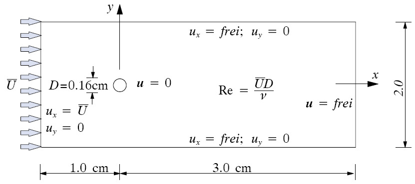
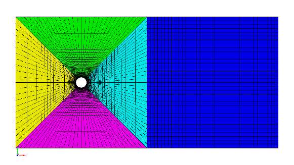
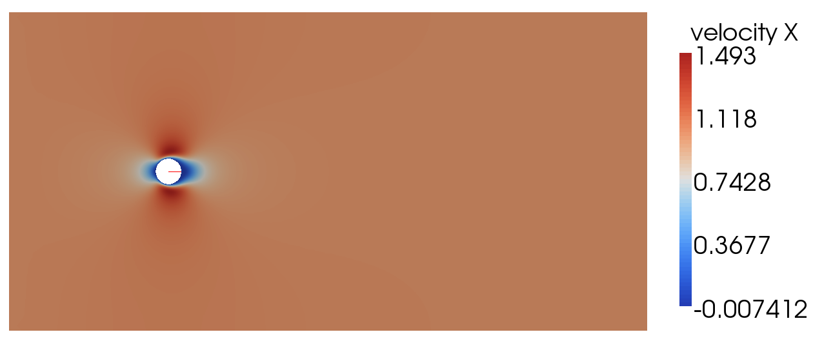

Fluid Tutorial with *pre_exodus* and Cubit
=============================================

.. _fluidtutorial:

For this as for all other tutorials you'll need a complete ``BACI`` installation
as well as access to the pre-processing tool *cubit* and the post-processing tool *paraview*.
If you did not do so already, install ``BACI`` based on the information given in the :ref:`Setup Guide to BACI <SetupGuidetoBACI>`.

Introduction
------------

In this tutorial we want to simulate the incompressible flow past a
circular cylinder. For further details and references we refer the reader to:
[Wall99]_

   Problem definition and geometrical setup (with friendly permission ;-))

Preprocessing
-------------

Creating the Geometry with Cubit
~~~~~~~~~~~~~~~~~~~~~~~~~~~~~~~~

We will use Cubit for creating the geometry and the mesh.
Within Cubit, open the Journal-Editor (*Tools* :math:`\to` *Journal
Editor*), paste the text below and press *play*. If the geometry
couldn’t be created, try to set the editor to ’Translate to Cubit
commands’ first and retry. Alternatively, double-check every single line
of the text, since sometimes errors occur during copying and pasting.
After successful geometry and mesh creation, export everything to an
Exodus-file of your choice via *File* :math:`\to`\ *Export...*. Select
the folder ``build-release`` created before, pick an arbitrary name for
the file, click on ``Save``, and then set the dimension explicitly to
2d.

.. literalinclude::  tutorial_fluid.jou
   :linenos:

When Cubit version 11.0 is used for
creating geometry and mesh, you have to adapt some of the previous
commands, since numbering of entities changed between Cubit versions!

The generated mesh should look like this:

   Mesh for a flow past a circular cylinder.

Working with *pre_exodus* and BACI
-------------------------------------

*pre_exodus* is a C++ code embedded into the BACI environment. It is
meant to transfer a given mesh into a BACI-readable input file.

Preliminaries
~~~~~~~~~~~~~

If not already done, compile *pre_exodus* in the ``build-release``
folder via

::

     make pre_exodus

after configuring BACI in the usual way.

General Procedure of Creating a Valid BACI Input File
~~~~~~~~~~~~~~~~~~~~~~~~~~~~~~~~~~~~~~~~~~~~~~~~~~~~~

With a given mesh including some nodal clouds to apply conditions to you
need another text-file (*bc-file  *) where you specify, what you would
like to do with it. It contains for example the specific element
declaration (fluid, structure, parameters, etc.) and the particular
boundary condition such as Dirichlet or Neumann. Finally, a *header-file* consists of general parameters such as solvers, algorithmic
parameters, etc. Those three files are merged by *pre_exodus* into an
input file for BACI. This file is then *automatically* validated using
all available BACI validation and is therefore likely to run.

Sure, you usually do not have already a proper *header-file* and
matching *bc-file*. By typing

.. container:: center

   ``./pre_exodus –exo=yourmesh.e``

in the ``build-release`` folder you get two preliminary files
’default.head’ and ’default.bc’. The first contains the currently valid
header parameters with default values and commented options which you
can edit to adapt it to your means. Similarly, ’default.bc’ consists of
all your mesh entities and a list of all currently valid conditions. See
next section for details how to work with them and how to create valid
input files.

Adapting the *header-file*
~~~~~~~~~~~~~~~~~~~~~~~~~~~~

Open the previously created *header-file* ’default.head’ and edit the
following entries as shown below.

-  ``PROBLEM TYP``

   ``PROBLEMTYP Fluid``

-  ``FLUID DYNAMIC``

   ``LINEAR_SOLVER 1``

   ``NUMSTEP 20``

   ``TIMESTEP 0.01``

-  ``SOLVER 1``

   ``NAME Fluid solver``

   ``SOLVER UMFPACK``

-  ``MATERIALS``

   insert the following line after ``------MATERIALS`` in order to
   define your material parameters:
   ``MAT 1 MAT_fluid DYNVISCOSITY 0.004 DENSITY 1.0``

-  ``CURVE 1``

   | insert the following line after ``------CURVE 1`` in order to
     define a time curve:
   | ``CURVE 1 on EXPR FUNC 0.5*(sin((t*pi/0.1)-(pi/2)))+0.5  t1 0.0 t2 0.1``

Save the file under a different name of your choice.

Adapting the *bc-file*
~~~~~~~~~~~~~~~~~~~~~~~~

Open the previously created *bc-file* ’default.bc’ and edit your
boundary conditions as shown below.

.. literalinclude:: tutorial_fluid.bc

Save the file under a different name of your choice.

Creating a BACI input file with *pre_exodus*
~~~~~~~~~~~~~~~~~~~~~~~~~~~~~~~~~~~~~~~~~~~~~~

The previously created files have to be merged to a BACI input file in
oder to solve the problem. We will use *pre_exodus* for this purpose.
Open a terminal and execute the following command in the
``build-release`` folder:

.. container:: center

   ``./pre_exodus --exo=<meshpath>/yourmesh.e --head=<headpath>/headerfile.head``
   ``--bc=<bcpath>/bcfile.bc --dat=<datpath>/datfile.dat``

Where the filenames and their paths have to be replaced according to how
you have named and where you have saved them. *pre_exodus* will
output a dat-file to the path you specified above.

Running a Simulation with BACI
~~~~~~~~~~~~~~~~~~~~~~~~~~~~~~

To start the solver use the call

.. container:: center

   ``./baci-release <inputdirectory>/datfile.dat <outputdirectory>/outputprefix``

in the ``build-release`` folder. You may have to adapt the name of the
executable in this command. The prefix that you have chosen before will
be applied to all output files that BACI generates.

Postprocessing
--------------

You can postprocess your results with any vizualization software you
like. In this tutorial, we choose *Paraview*.

Filtering result data
~~~~~~~~~~~~~~~~~~~~~

-  Before you can admire your results, you have to generate a filter
   which converts the generic binary BACI output to the desired format.
   Starting from the ``build-release`` directory, execute
   ``make post_drt_ensight``.

-  The filter should now be available in the ``build-release`` folder.
   Filter your results with the following call inside the
   ``build-release`` folder:

   .. container:: center

      ``./post_drt_ensight - -file=<outputdirectory>/outputprefix``

-  Further options of the filter program are made visible by the command
   ``./post_drt_ensight –help``

Visualize your results in Paraview
~~~~~~~~~~~~~~~~~~~~~~~~~~~~~~~~~~

-  After the filtering process is finished open *paraview* by typing

::

      paraview &

-  *File :math:`\to` Open* and select the filtered ``*\*.case*`` file:
   *outputprefix_fluid.case*

-  Choose *LittleEndian* instead of *BigEndian* in case you have an old
   version of Paraview.

-  Press *Apply* to activate the display.

-  Set the time step in the top menu bar to :math:`19` (:math:`=0.2`).

-  In the *Color* section you can now choose between *pressure* and
   *velocity*. Select velocity and pick the :math:`X`-component from the
   adjacent drop-down menu. Then press the *Rescale* button and the
   *Show* button. You receive a visualization of the :math:`X`-velocity
   field, which should look similar to this figure:

   :math:`X`-velocity for a flow past a circular cylinder

