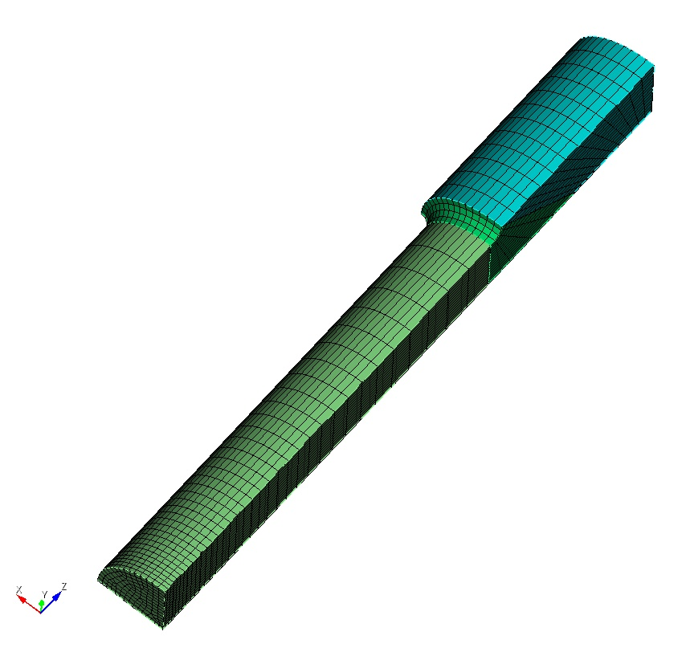

3D Solid Tutorial with Cubit and *pre_exodus* 
=======================================================

   Geometry of a round tensile bar made of elasto-plastic material.

.. note::

   Here I would appreciate having a tutorial for solid mechanics as well.
   Jan Schnabel did a nice solid mechanics introduction that might be suitable.
